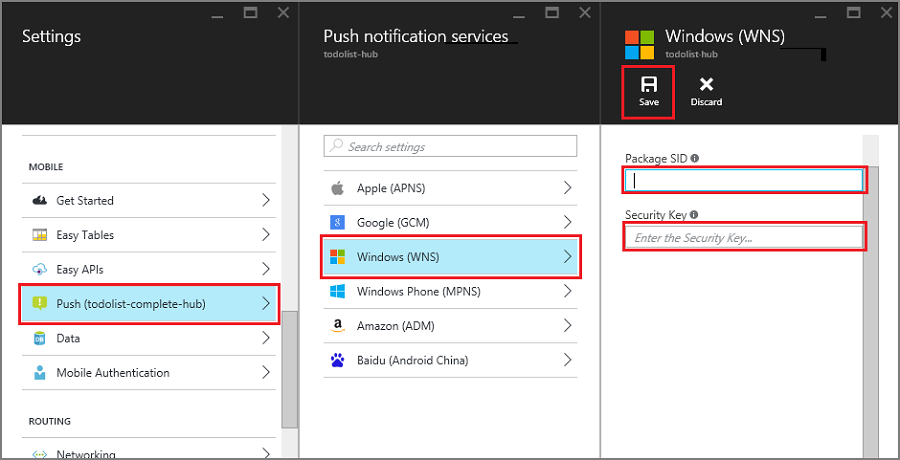

1. Klicken Sie im [Azure-Portal](https://portal.azure.com/)auf **Alle durchsuchen** > **App Services** > Ihre Mobile-App Back-End. Klicken Sie unter **Einstellungen**auf **App Dienst Pushbenachrichtigungen**klicken Sie auf die Namen der Benachrichtigung Hub.

2. Wählen Sie in **Windows (WNS)**, geben Sie die **Taste Sicherheit** (Client geheim) und **Paket SID** an, die Sie von der Website Live-Dienste erhalten haben, dann klicken Sie auf **Speichern**.

    

Ihre Back-End-ist jetzt so konfiguriert, dass die WNS verwenden, um Pushbenachrichtigungen zu senden.
