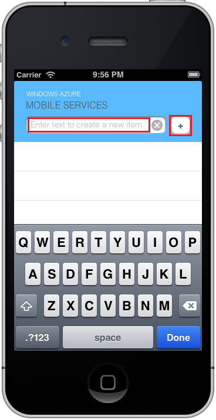

1. Finden Sie auf Ihrem Mac auf der [Azure-Portal]. Klicken Sie auf **Alle durchsuchen** > **Mobile-Apps** > die Back-End-, die Sie soeben erstellt haben. Klicken Sie in der mobilen app-Einstellungen auf **Schnellstart** > **iOS (Ziel-C)**. Falls Swift gewünscht, klicken Sie auf **Schnellstart** > **iOS (Swift)** stattdessen. Klicken Sie unter **herunterladen, und führen Sie Ihr Projekt iOS**klicken Sie auf **herunterladen**. Diese downloads ein vollständiges Xcode Projekt für eine app, die vorab so konfiguriert, dass Ihre Back-End-Verbindung. Öffnen Sie das Projekt Xcode verwenden.

2. Drücken Sie die Schaltfläche **Ausführen** , erstellen Sie das Projekt, und starten Sie die app in den iOS-Simulator.

3. Geben Sie einen aussagekräftigen Text, z. B. _vollständig des Lernprogramms_ der app, und klicken Sie dann auf das Pluszeichen (**+**) Symbol. Sendet eine POST-Anforderung an das Azure Back-End-, die, das Sie zuvor bereitgestellt. Die Back-End-fügt Daten aus der Anforderung in der Tabelle TodoItem SQL ist, und gibt Informationen über die neu gespeicherten Elemente wieder zur mobile-app. Die mobile-app zeigt diese Daten in der Liste an. 

    

[Azure-Portal]: https://portal.azure.com/
