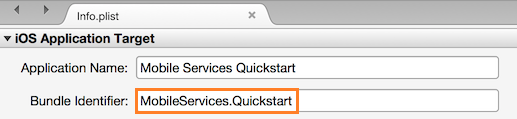

####Konfigurieren des Projekts iOS in Xamarin Studio

1. Öffnen Sie **"Info.plist"**in Xamarin.Studio und aktualisieren Sie das **Paket Bezeichner** die Paket-ID, die Sie zuvor erstellt haben, mit Ihrer neuen App-ID an.

    

2. Führen Sie einen Bildlauf nach unten bis zum **Hintergrund Modi** , und aktivieren Sie im Feld **Hintergrund Modi aktivieren** und im Feld **Remote Benachrichtigungen** . 

    

3. Klicken Sie mit der Doppelklicken auf Ihr Projekt im Bereich Lösung, um **Project-Optionen**zu öffnen.

4.  Wählen Sie **iOS-Paket bei der Anmeldung** unter **Erstellen**, und wählen Sie die entsprechende **Identität** und **Provisioning Profil** Sie nur für dieses Projekt eingerichtet hatten. 

    

    Dadurch wird sichergestellt, dass das Projekt neue Profil zum Signieren von Code verwendet. Die offiziellen Dokumentation zur Bereitstellung Xamarin von Geräten finden Sie unter [Xamarin Gerät bereitgestellt].

####Konfigurieren des iOS-Projekts in Visual Studio

1. Klicken Sie in Visual Studio mit der rechten Maustaste in des Projekts, und klicken Sie dann auf **Eigenschaften**.

2. Klicken Sie auf der Registerkarte **iOS-Anwendung** , und aktualisieren Sie der **Bezeichner** die ID, die Sie zuvor erstellt haben, auf den Eigenschaftenseiten.

    

3. Wählen Sie auf der Registerkarte **iOS-Paket signieren** entsprechende **Identität** und **Provisioning Profil** Sie nur für dieses Projekt eingerichtet hatten. 

    

    Dadurch wird sichergestellt, dass das Projekt neue Profil zum Signieren von Code verwendet. Die offiziellen Dokumentation zur Bereitstellung Xamarin von Geräten finden Sie unter [Xamarin Gerät bereitgestellt].

4. Klicken Sie mit der Doppelklicken auf "Info.plist" zum Öffnen, und aktivieren Sie dann die **RemoteNotifications** unter Modi Hintergrund. 

[Xamarin zur Bereitstellung von Geräten]: http://developer.xamarin.com/guides/ios/getting_started/installation/device_provisioning/