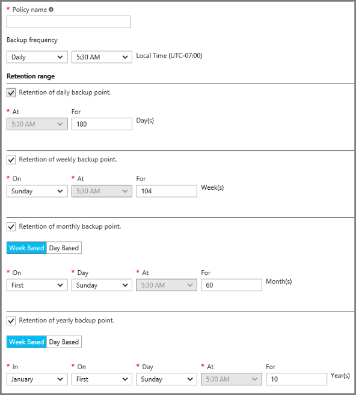

## Definieren einer Richtlinie Sicherung

Eine zusätzliche Richtlinie definiert eine Matrix, wenn die Daten Momentaufnahmen geöffnet sind und wie lange dieser Momentaufnahmen gespeichert werden sollen. Beim Definieren einer Richtlinie für einen virtuellen sichern, können Sie eine Sicherung *täglich*auslösen. Wenn Sie eine neue Richtlinie erstellen, wird es zum Tresor angewendet. Die Benutzeroberfläche für die Sicherungsdatei Richtlinie sieht wie folgt aus:

So erstellen Sie eine Richtlinie

1. Geben Sie einen Namen für den **Namen der Richtlinie**ein.

2. Momentaufnahmen der Daten können täglich oder wöchentlich Abständen absolviert werden. Verwenden Sie die **Sicherung Häufigkeit** Dropdownmenü auswählen, ob Daten Momentaufnahmen täglich geöffnet sind oder wöchentlich aus.

    - Wenn Sie einem täglichen Intervall auswählen, verwenden Sie das hervorgehobene Steuerelement die Uhrzeit des Tages für den Snapshot aus. Ändern die Stunde, heben Sie die Markierung der Stunde, und wählen die neue Stunde.

      

    - Wenn Sie eine wöchentliche Intervall auswählen, verwenden Sie die hervorgehobenen Steuerelemente die Wochentage und die Uhrzeit für die Momentaufnahme erstellen auswählen. Wählen Sie einen oder mehrere Tage aus, klicken Sie im Menü Tag. Wählen Sie im Menü Stunde 1 Stunde. Ändern die Stunde, heben Sie die Markierung der ausgewählten Stunde, und wählen die neue Stunde.

    

3. Standardmäßig werden alle **Aufbewahrungszeitraum** Optionen ausgewählt. Deaktivieren Sie die Einschränkungen hinsichtlich der Aufbewahrungsrichtlinien-Bereich, die Sie nicht verwenden möchten. Geben Sie dann die Interval(s) verwenden.

    Monatliche und jährliche Aufbewahrung Bereiche ermöglichen es Ihnen, die ein Inkrement wöchentlich oder täglich ausgehend von Momentaufnahmen angeben.

    >[AZURE.NOTE] Beim eines virtuellen Computers zu schützen, führt eine Sicherung einmal täglich aus. Die Uhrzeit, wann die Sicherung ausgeführt wird, ist für jeden Bereich Aufbewahrung identisch.

4. Klicken Sie nach dem Einrichten alle Optionen für die Richtlinie, am oberen Rand der Blade auf **Speichern**.

    Die neue Richtlinie wird auf dem Tresor sofort angewendet.
