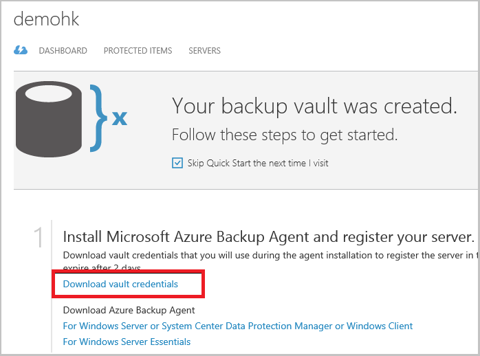

## Verwenden von Tresor Anmeldeinformationen zum Authentifizierung mit dem Dienst Azure Sicherung

Der Server lokal (Windows-Client oder Windows Server oder Data Protection Manager-Server) muss mit einer Sicherungskopie Tresor authentifiziert werden, bevor sie Daten in Azure sichern kann. Die Authentifizierung erfolgt mithilfe von "vault Anmeldeinformationen". Des Konzepts der Tresor Anmeldeinformationen ähnelt des Konzepts einer Datei mit "veröffentlichungseinstellungen" Azure PowerShell verwendet wird.

### Was ist die Tresor Anmeldeinformationen-Datei?

Die Tresor Anmeldeinformationen Datei ist ein Zertifikat vom Portal für jede zusätzliche Tresor generiert. Im Portal uploads öffentlichen Schlüssel klicken Sie dann auf die Service (ACS). Der private Schlüssel des Zertifikats ist für dem Benutzer als Teil der Workflow bereitgestellt, denen als Eingabe in den Computer Registrierung Workflow zugewiesen ist. Dies authentifiziert den Computer, um zusätzliche Daten zu einer identifizierten Tresor in die Sicherung Azure Service senden.

Die Anmeldeinformationen Tresor wird nur während der Registrierung Workflow verwendet. Es ist Aufgabe des Benutzers, um sicherzustellen, dass die Datei Tresor Anmeldeinformationen nicht beeinträchtigt wird. Fällt in die Hände von einem beliebigen für nicht autorisierte Benutzer, kann die Datei Tresor Anmeldeinformationen auf anderen Computern mit der gleichen Tresor registrieren verwendet werden. Jedoch, wie die Sicherung Daten verschlüsselt sind, verwenden ein Kennwort ein, die an den Kunden gehört, können nicht vorhandene Sicherung Daten beeinträchtigt werden. Um dieses Problem zu verringern, sind die Tresor Anmeldeinformationen festgelegt in 48 Std. abläuft. Sie können den Anmeldeinformationen Tresor einer Sicherung Wölbung beliebig häufig – herunterladen, aber nur die neueste Tresor Anmeldeinformationsdatei ist während des Registrierung Workflows anwendbar.

### Herunterladen der Datei Tresor Anmeldeinformationen

Die Tresor Anmeldeinformationen-Datei wird durch einen Kanal vom Azure-Portal heruntergeladen. Der Dienst Azure Sicherung kann nicht den privaten Schlüssel des Zertifikats erkennen und der private Schlüssel wird nicht beibehalten, in dem Portal oder den Dienst. Gehen Sie folgendermaßen vor, um die Tresor Anmeldeinformationen-Datei auf einem lokalen Computer herunterzuladen.

1.  Melden Sie sich bei dem [Verwaltungsportal](https://manage.windowsazure.com/)
2.  Klicken Sie im linken Navigationsbereich auf **Wiederherstellung Services** , und wählen Sie aus der Sicherungsdatei Tresor, die Sie erstellt haben. Klicken Sie auf das Symbol der Cloud, um die Sicherungsdatei Tresor der Ansicht Schnellstart zu gelangen.

    

3.  Klicken Sie auf der Seite Schnellstart auf **Tresor Anmeldeinformationen zum Herunterladen**. Im Portal generiert die Tresor Anmeldeinformationen-Datei, die zum Download zur Verfügung gestellt wird.

    

4.  Im Portal wird mit einer Kombination aus den Tresor Namen und dem heutigen Datum Tresor Anmeldeinformationen generieren. Klicken Sie auf **Speichern** , um die Tresor Anmeldeinformationen auf dem lokalen Konto Downloadordners herunterzuladen, oder wählen Sie speichern unter aus dem Menü speichern, um einen Speicherort für die Anmeldeinformationen Tresor anzugeben.

### Notiz
- Stellen Sie sicher, dass die Anmeldeinformationen Tresor gespeichert ist, an einem Speicherort, die von Ihrem Computer aus zugegriffen werden kann. Wenn sie in einer Datei freigeben/SMB gespeichert ist, prüfen Sie die Zugriffsberechtigungen.
- Die Datei Tresor Anmeldeinformationen wird nur während der Registrierung Workflow verwendet.
- Die Datei Tresor Anmeldeinformationen läuft ab nach 48 Std. und aus dem Portal heruntergeladen werden kann.
- Schlagen Sie in der Azure Sicherung [häufig gestellte Fragen](../articles/backup/backup-azure-backup-faq.md) für Fragen auf den Workflow.
