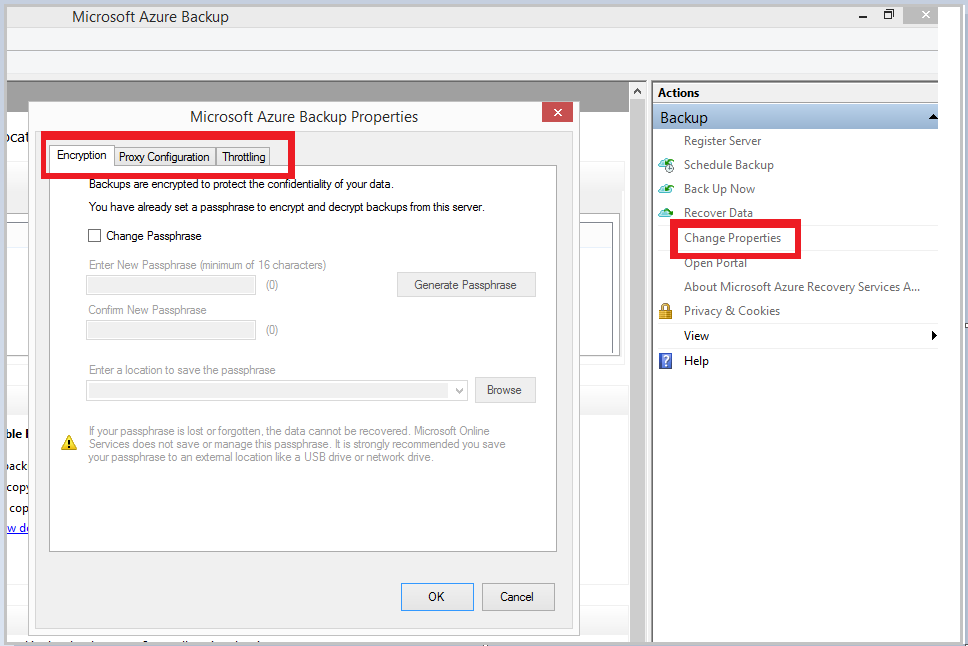
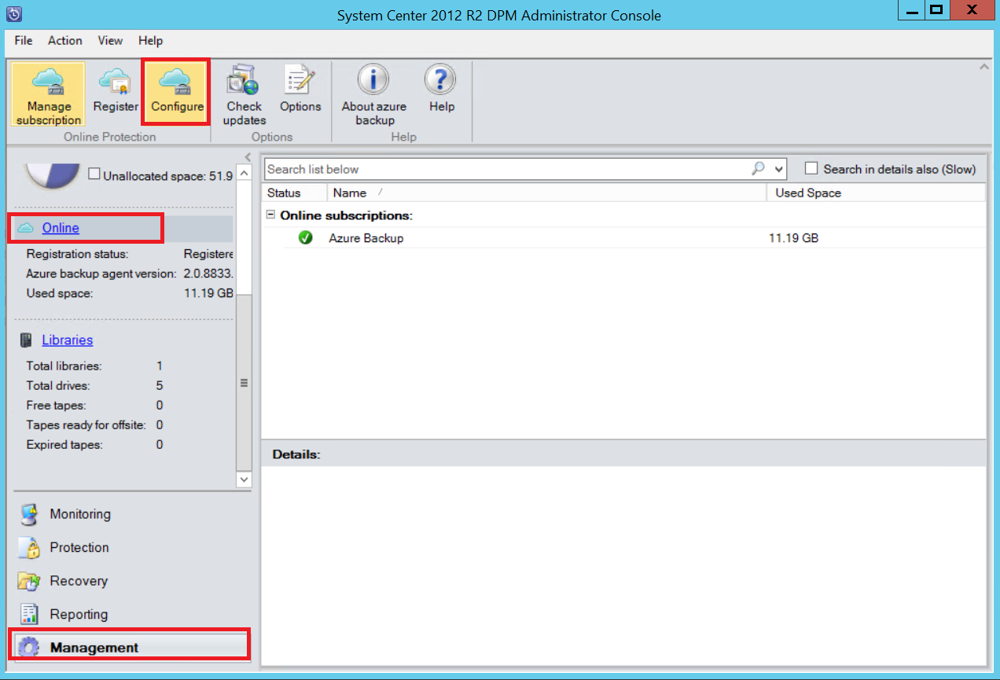

## Herunterladen, installieren und Sichern von Azure-Agent registrieren

Nach dem Erstellen des Sicherung von Azure Tresors, sollte ein Agent auf jedem Windows-Computer (Windows Server, Windows-Client, System Center Data Protection Manager-Server oder Azure Sicherung Servercomputer), die Sichern von Daten und Applikationen in Azure ermöglicht installiert werden.

1. Melden Sie sich bei dem [Verwaltungsportal](https://manage.windowsazure.com/)

2. Klicken Sie auf **Wiederherstellung Dienste**, und wählen Sie dann den Sicherung Tresor, den Sie bei einem Server registrieren möchten. Die Seite Schnellstart für die Sicherungsdatei Tresor wird angezeigt.

    

3. Klicken Sie auf der Seite Schnellstart auf die Option **für Windows Server oder System Center Data Protection Manager oder Windows-Client** unter **Agent herunterladen**. Klicken Sie auf **Speichern** , um ihn auf den lokalen Computer zu kopieren.

    

4. Nachdem der Agent installiert wurde, Doppelklick MARSAgentInstaller.exe zum Starten der Installations des Agents Azure sichern. Wählen Sie den Ordner für die Installation und Entwurfsbereich Ordner für den Agent erforderlich. Speicherort des angegebenen benötigen Speicherplatz mindestens 5 % der Sicherungsdatei Daten.

5.  Wenn Sie einen Proxyserver verwenden, mit dem Internet verbinden, geben Sie im Bildschirm **Proxy-Konfiguration** Proxy-Server-Details. Wenn Sie einen authentifizierten Proxy verwenden, geben Sie die Benutzerdetails Anmeldename und das Kennwort in dieser Bildschirm.

6.  Der Sicherung Azure-Agent installiert .NET Framework 4.5 und Windows PowerShell (sofern nicht bereits verfügbar) um die Installation durchzuführen.

7.  Nachdem der Agent installiert ist, klicken Sie auf die Schaltfläche **Weiter zu Registrierung** , um den Workflow fortzusetzen.

    

8. Klicken Sie im Bildschirm Anmeldeinformationen Tresor zu navigieren Sie, und wählen Sie die Tresor Anmeldeinformationen Datei, die zuvor heruntergeladen wurde.

    

    Die Datei Tresor Anmeldeinformationen gilt nur für 48 Std. (nachdem sie auf dem Portal heruntergeladen wurde). Wenn Sie alle Fehler in dieser Bildschirm (z. B. "Tresor Anmeldeinformationen Datei abgelaufen ist") bereitgestellt, Anmeldung Azure-Portal auftreten und Tresor Anmeldeinformationen erneut herunterladen.

    Sicherstellen Sie, dass die Tresor Anmeldeinformationen Datei an einem Speicherort die durch die Setup-Anwendung zugegriffen werden kann verfügbar ist. Wenn auftreten Zugriff auf verwandte Fehler, kopieren Sie die Tresor Anmeldeinformationen-Datei in ein temporäres Verzeichnis auf diesem Computer, und wiederholen Sie den Vorgang.

    Wenn Sie einen Ungültiges Tresor Anmeldeinformationen Fehler (z. B. "Ungültige Tresor Anmeldeinformationen bereitgestellten") auftreten die Datei ist entweder beschädigt oder unterstützt die neuesten Anmeldeinformationen zugeordnet sind mit der Wiederherstellungsdienst. Wiederholen Sie den Vorgang nach dem Herunterladen einer neuen Tresor Anmeldeinformationsdatei aus dem Portal ein. Dieser Fehler wird in der Regel angezeigt, wenn der Benutzer auf die Option **Download Tresor Anmeldeinformationen** im Portal Azure schnell hintereinander klickt. In diesem Fall ist nur die zweite Tresor Anmeldeinformationsdatei gültig.

9. Klicken Sie im Bildschirm **Verschlüsselung Einstellung** können Sie ein Kennwort generieren oder geben Sie ein Kennwort (mindestens 16 Zeichen). Denken Sie daran, um das Kennwort an einem sicheren Ort zu speichern.

    

    > [AZURE.WARNING] Wenn das Kennwort verloren gegangen oder vergessen; Microsoft kann nicht in der Wiederherstellung der Sicherungskopie Daten helfen. Der Benutzer besitzt, das Kennwort für die Verschlüsselung und Microsoft hat keinen Einblick in das Kennwort, das vom Endbenutzer verwendet. Speichern Sie die Datei an einem sicheren Ort wie während eines Wiederherstellungsvorgangs erforderlich ist.

10. Nachdem Sie auf die Schaltfläche **Fertig stellen** klicken, wird der Computer erfolgreich zum Tresor registriert ist, und werden jetzt sichern auf Microsoft Azure beginnen.

11. Bei Verwendung von Microsoft Azure Sicherung eigenständigen können Sie die angegebenen während des Workflows für die Registrierung, indem Sie auf die Option **Eigenschaften ändern** , in der Azure Sicherung Mmc-Snap-in Einstellungen ändern.

    

    Wenn Sie Data Protection Manager verwenden, können Sie alternativ während der Registrierung Workflow durch Klicken auf die Option **Konfigurieren** , indem Sie **Online** unter der Registerkarte **Verwaltung** auswählen festgelegte Einstellung ändern.

    
