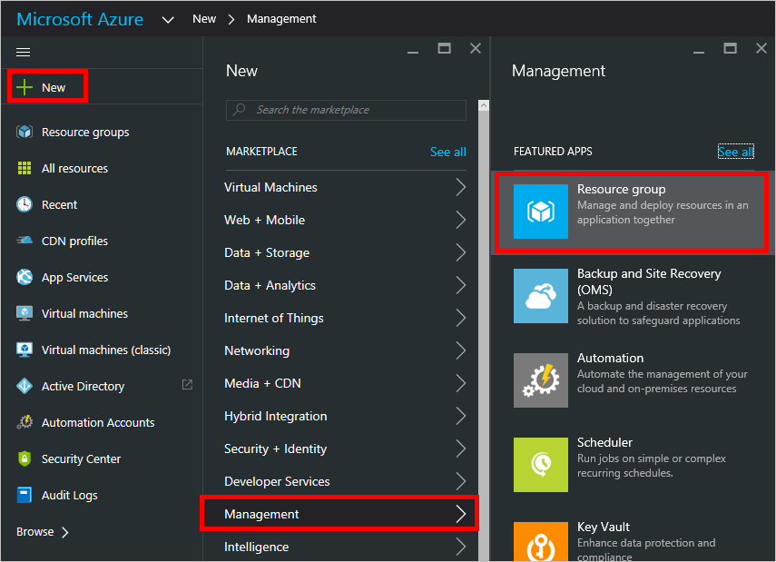
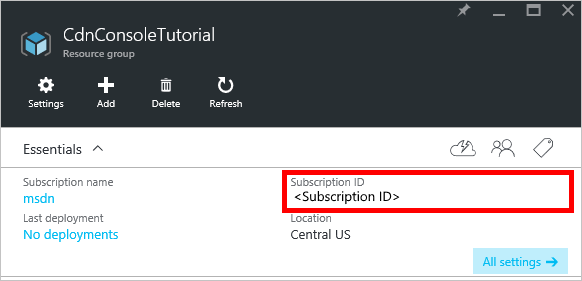
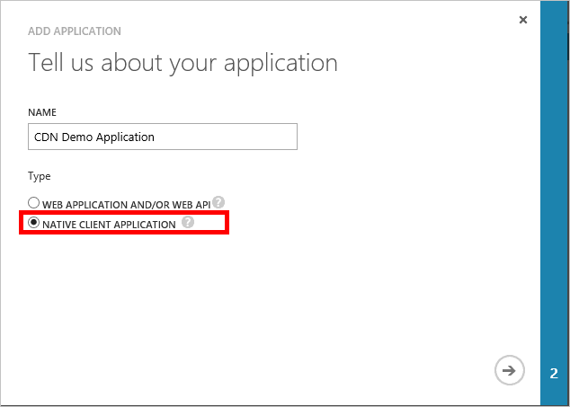

## Erforderliche Komponenten

Bevor wir CDN Management Code schreiben können, müssen wir unseren Code interagieren mit Azure-Manager aktivieren vorbereitende Schritte ausführen.  Dazu müssen Sie:

* Erstellen Sie eine Ressourcengruppe aus, um das Profil CDN enthalten, das wir in diesem Lernprogramm erstellen
* Konfigurieren von Azure Active Directory zur Authentifizierung für unsere Anwendung aufrechterhalten
* Anwenden von Berechtigungen der Ressourcengruppe, dass nur autorisierte Benutzer von unserer Azure AD-Mandanten mit unseren CDN Profil interagieren können

### Erstellen der Ressourcengruppe

1. Melden Sie sich bei der [Azure-Portal](https://portal.azure.com).

2. Klicken Sie auf die Schaltfläche **neu** in der oberen linken Ecke, und klicken Sie dann **Management**und **Ressourcengruppe**.
    
    

3. Rufen Sie Ihre Ressourcengruppe *CdnConsoleTutorial*.  Wählen Sie Ihr Abonnement aus, und wählen Sie einen Speicherort in Ihrer Nähe.  Wenn Sie möchten, können Sie das Kontrollkästchen **Pin zum Dashboard** die Ressourcengruppe zum Dashboard im Portal anheften klicken.  Dies wird später finden erleichtern.  Nachdem Sie Ihre Auswahl getroffen haben, klicken Sie auf **Erstellen**.

    

4. Nach die Ressourcengruppe, erstellt wird Wenn Sie es zum Dashboard anheften haben, können Sie ihn durch Klicken auf **Durchsuchen**, und klicken Sie dann **Gruppen Ressource**finden.  Klicken Sie auf die Ressourcengruppe aus, um ihn zu öffnen.  Notieren Sie Ihre **Abonnement-ID**.  Wir benötigen sie später.

    

### Erstellen der Anwendung Azure AD- und Anwenden von Berechtigungen

Es gibt zwei Vorgehensweisen zur app-Authentifizierung mit Azure Active Directory: einzelne Benutzer oder eine Tilgungsanteile Dienst. Ein Dienst Hauptbenutzer ist vergleichbar mit einer Dienstkontos in Windows.  Statt erteilen, einen bestimmten Benutzer Berechtigungen für die Interaktion mit den Profilen CDN, erteilen Sie stattdessen über die Berechtigungen, um die wichtigsten Dienst.  Dienst Hauptbenutzer werden in der Regel für automatisierte, nicht interaktive Prozesse verwendet werden.  Obwohl in diesem Lernprogramm eine interaktiven Console-app schreiben ist, konzentrieren wir uns auf die wichtigsten Dienst-Ansatz.

Erstellen einer Tilgungsanteile Dienst besteht aus mehreren Schritten, einschließlich der Erstellung der Anwendung Azure Active Directory.  Hierzu wird so [folgen Sie diesem Lernprogramm](../articles/resource-group-create-service-principal-portal.md)gezeigt.

> [AZURE.IMPORTANT] Achten Sie darauf, dass alle Schritte in der [verknüpften Lernprogramm](../articles/resource-group-create-service-principal-portal.md)ausgeführt werden.  Es ist *äußerst wichtig* , dass Sie genau wie beschrieben ausführen.  Vergewissern Sie sich in Ihrem **Mandanten-ID**, **Mandanten Domänennamen** zu beachten (häufig eine *. onmicrosoft.com* Domäne, wenn Sie eine benutzerdefinierte Domäne angegeben haben), **Client-ID**und **Client-Authentifizierungsschlüssel**, da wir diese später benötigen.  Achten Sie zum Schutz Ihrer **Client-ID** und **Client-Authentifizierungsschlüssel**, wie diese Anmeldeinformationen durch jeden auszuführende Vorgänge als die Tilgungsanteile Dienst verwendet werden können. 
>   
> Wenn Sie den Schritt, mit dem Namen [Konfigurieren mit mehreren Mandanten Anwendung](../articles/resource-group-create-service-principal-portal.md#configure-multi-tenant-application)zu gelangen, wählen Sie **Nein**aus.
> 
> Wenn Sie mit der [Anwendung, die Rolle zuweisen](../articles/resource-group-create-service-principal-portal.md#assign-application-to-role)Schritt erhalten, statt der **Leser** -Rolle zuweisen der **CDN Profil** Teilnehmerrolle verwenden der Ressourcengruppe wir *CdnConsoleTutorial*zuvor erstellt haben.  Nachdem Sie der Anwendung der Teilnehmerrolle **CDN Profil** auf Ihre Ressourcengruppe zugewiesen haben, kehren Sie zu diesem Lernprogramm zurück. 

Nachdem Sie erstellten des Diensts Hauptbenutzer und zugewiesen der Teilnehmerrolle **CDN Profil** , das Blade **Benutzer** für die Ressourcengruppe aussehen vergleichbar ist.

### Interaktive Benutzerauthentifizierung

Wenn anstelle eines Tilgungsanteile Dienst Sie lieber interaktive einzelne Benutzerauthentifizierung fungieren sollen, ist der Prozess, die für einen Dienst Tilgungsanteile sehr ähnlich.  Tatsächlich müssen Sie dasselbe Verfahren, aber einige kleinere Änderungen vornehmen.

> [AZURE.IMPORTANT] Nur führen Sie die nächsten Schritte, wenn Sie einzelne Benutzerauthentifizierung statt als Hauptbenutzer Dienst verwenden.

1. Bei der Erstellung der Anwendungs, statt **Web-Anwendung**, wählen Sie in **einer systemeigenen Anwendung**. 
    
    
    
2. Klicken Sie auf der nächsten Seite werden Sie für eine **URI umleiten**aufgefordert werden.  Der URI wird nicht überprüft werden, aber denken Sie daran, was Sie eingegeben haben.  Sie benötigen es später. 

3. Es ist nicht erforderlich zum Erstellen eines **Client-Authentifizierungsschlüssel**ein.

4. Statt eine Dienst Tilgungsanteile die **CDN Profil Mitwirkender** Rolle zuweisen, wird gezeigt, einzelne Benutzer oder Gruppen zuweisen.  In diesem Beispiel können Sie sehen, dass ich der **CDN Profil** Teilnehmerrolle *CDN Demo Benutzer* zugewiesen haben.  
    
    

