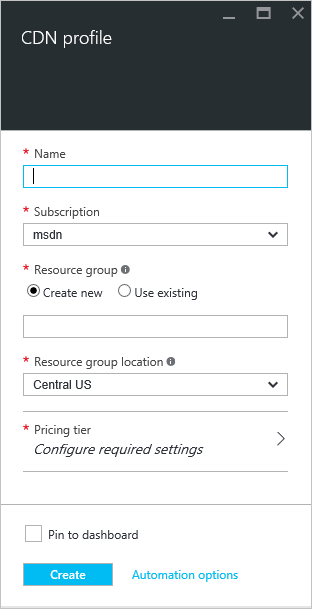

**Zum Erstellen eines neuen CDN-Profils**

1. Klicken Sie im [Portal Azure](https://portal.azure.com)in der oberen linken Ecke auf **neu**.  Wählen Sie in das **neue** Blade **Medien + CDN**, und klicken Sie dann **CDN**aus.

    Das neue CDN Profil Blade wird angezeigt.

    

2. Geben Sie einen Namen für Ihr Profil CDN aus.

3. Wählen Sie einen **Speicherort**aus.  Dies ist der Azure-Speicherort, wo Ihre Profilinformationen CDN gespeichert werden.  Es hat keine Auswirkung auf CDN Endpunkt Speicherorte.

4. Wählen Sie aus, oder erstellen Sie eine **Ressourcengruppe**.  Weitere Informationen zu Ressourcengruppen finden Sie unter [Übersicht Azure Ressourcenmanager](resource-group-overview.md#resource-groups).

5. Wählen Sie eine **Ebene Preise**aus.  Finden Sie unter [Übersicht CDN](cdn-overview.md#azure-cdn-features) für einen Vergleich der Preisgestaltung leisten.
    
    

6. Wählen Sie das **Abonnement** für dieses Profil CDN aus.

7. Klicken Sie auf die Schaltfläche **Erstellen** , um das neue Profil zu erstellen. 