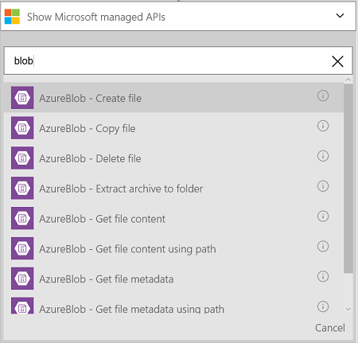
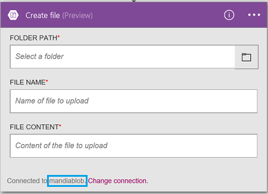

### Erforderliche Komponenten
- Ein Azure-Konto; Sie können ein [kostenloses Konto](https://azure.microsoft.com/free) erstellen.
- Ein [Konto Azure BLOB-Speicher](../articles/storage/storage-create-storage-account.md) , einschließlich den Kontonamen für den Speicher und die Zugriffstaste. Diese Informationen werden in den Eigenschaften des Speicherkontos Azure-Portal aufgeführt. Weitere Informationen zum [Azure-Speicher](../articles/storage/storage-introduction.md).

Verbinden Sie bevor Sie Ihr Konto Azure BLOB-Speicher in einer app Logik verwenden bei Ihrem Konto Azure BLOB-Speicher. Sie können ganz einfach in der app Logik im Azure-Portal ausführen.  

Verbinden mit Ihrer Azure BLOB-Speicher-Konto mithilfe der folgenden Schritte:  

1. Erstellen einer app Logik. Hinzufügen eines Triggers im Logik Apps-Designer, und fügen Sie eine Aktion. Wählen Sie in der Dropdownliste aus **Microsoft anzeigen verwaltete APIs** , und geben Sie "Blob" in das Suchfeld ein. Wählen Sie eine der Aktionen aus:  

      

2. Wenn Sie alle Verbindungen mit Azure-Speicher zuvor erstellt haben, werden Sie aufgefordert, die Verbindungsdetails:   

      

3. Geben Sie die Details des Speicher-Konto an. Eigenschaften mit einem Sternchen sind erforderlich.

    | Eigenschaft | Details |
|---|---|
| Verbindungsnamen * | Geben Sie einen beliebigen Namen für die Verbindung aus. |
| Kontoname Azure-Speicher * | Geben Sie den Namen des Kontos Speicher aus. Den Namen des Kontos Speicher wird in den Speichereigenschaften Azure-Portal angezeigt. |
| Azure-Speicher Konto Zugriffstaste * | Geben Sie im Speicher kontoschlüssel ein. Die Tastenkombinationen werden in den Speichereigenschaften Azure-Portal angezeigt. |

    Diese Anmeldeinformationen werden verwendet, um Ihre app Logik zum Verbinden und zum Zugreifen auf Ihre Daten zu autorisieren. 

4. Wählen Sie auf **Erstellen**.

5. Beachten Sie, dass die Verbindung erstellt wurde. Jetzt, fahren Sie mit den Schritten in Ihrer app Logik: 

      
