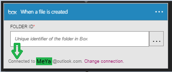

### Erforderliche Komponenten

- Ein Konto [im Feld](http://box.com)  

Bevor Sie Ihr Konto im Feld in einer app Logik verwenden können, müssen Sie die Verbindung mit Ihrem Konto im Feld Logik app autorisieren. Glücklicherweise können Sie ganz einfach aus innerhalb der app Logik im Portal Azure ausführen.  

Hier sind die Schritte zum Autorisieren Ihre app Logik eine Verbindung mit Ihrem Konto im Feld ein:  
1. Um eine Verbindung mit dem Feld im Logik app-Designer erstellen, wählen Sie in der Dropdownliste aus **Microsoft anzeigen verwaltete APIs** und dann geben Sie *im Feld* in das Suchfeld ein. Wählen Sie den oder die Aktion, die Sie verwenden möchten, werden:  
  
2. Wenn Sie alle Verbindungen mit vor dem Feld erstellt haben, werden angezeigt wird, geben Sie Ihre Anmeldeinformationen Feld. Diese Anmeldeinformationen verwendet werden, Ihre app Logik Verbindung zu autorisieren, und Sie Zugriff auf Ihr Konto im Feld Daten:  
  
3. Bieten Sie Ihren Feld-Benutzernamen und Ihr Kennwort ein, um Ihre app Logik zu autorisieren:  
   
4. Lassen Sie uns das Herstellen einer zu:  
  
5. Beachten Sie die Verbindung eingerichtet wurde, und Sie können jetzt mit den anderen Schritten in der app Logik fortfahren:  
  
