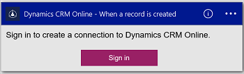

#### Erforderliche Komponenten
- Ein Azure-Konto; Sie können ein [kostenloses Konto](https://azure.microsoft.com/free) erstellen.
- Ein [Dynamics CRM Online](https://www.microsoft.com/en-us/dynamics/crm-free-trial-overview.aspx) -Konto 

Autorisieren Sie, bevor Sie Ihr Konto Dynamics in einer app Logik verwenden, die Verbindung zu Ihrem Konto CRM Online Logik-app. Sie können ganz einfach in der app Logik im Azure-Portal ausführen. 

Zustimmen möchten Sie Ihre app Logik Verbindung zu Ihrem CRM Online-Konto mithilfe der folgenden Schritte aus:

1. Erstellen einer app Logik. Im Logik Apps-Designer wählen Sie in der Dropdown-Liste **anzeigen Microsoft verwaltete APIs** aus, und geben Sie "Dynamics" in das Suchfeld. Wählen Sie eine der Trigger oder Aktionen aus:  
  
2. Wenn Sie alle Verbindungen mit Dynamics zuvor erstellt haben, werden Sie aufgefordert, melden Sie sich mit Ihren Anmeldeinformationen Dynamics:  
  
3. Wählen Sie **Anmelden**aus, und geben Sie Ihren Benutzernamen und Ihr Kennwort ein. Wählen Sie **Anmelden**aus. 

    Diese Anmeldeinformationen werden verwendet, Ihre app Logik Herstellen einer Verbindung mit sowie der Zugriff auf die Daten in Ihr Konto Dynamics zu autorisieren. 
4. Beachten Sie, dass die Verbindung erstellt wurde. Jetzt, fahren Sie mit den Schritten in Ihrer app Logik:  
  
