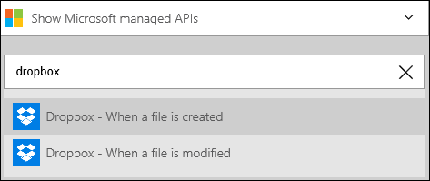
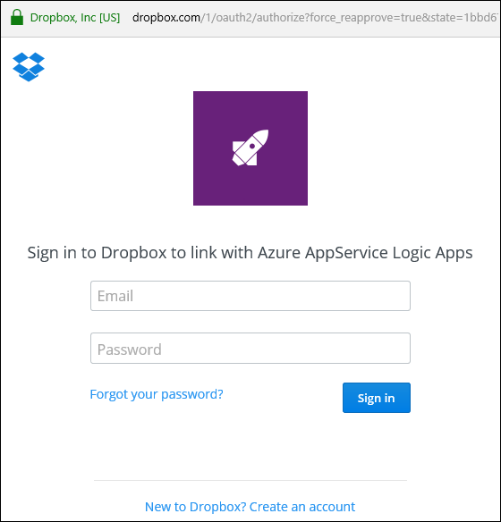

### Erforderliche Komponenten
- Ein [Dropbox](https://www.Dropbox.com/) -Konto 

Bevor Sie Ihr Konto Dropbox in einer app Logik verwenden können, müssen Sie die Verbindung mit Ihrem Konto Dropbox Logik app autorisieren. Glücklicherweise können Sie ganz einfach aus innerhalb der app Logik im Portal Azure ausführen. 

Hier sind die Schritte aus, um Ihre app Logik eine Verbindung mit Ihrem Konto Dropbox autorisieren ein:

1. Um eine Verbindung mit Dropbox, in dem Logik app-Designer erstellen, wählen Sie in der Dropdownliste aus **Microsoft anzeigen verwaltete APIs** dann geben Sie *Dropbox* in das Suchfeld ein. Wählen Sie den oder die Aktion, die Sie verwenden möchten, werden:  
  
2. Wenn Sie alle Verbindungen mit Dropbox vor erstellt haben, werden angezeigt wird, geben Sie Ihre Anmeldeinformationen Dropbox. Diese Anmeldeinformationen verwendet werden, Ihre app Logik Verbindung zu autorisieren, und Sie Zugriff auf Ihr Konto Dropbox Daten:  
  
3. Bieten Sie Ihren Dropbox-Benutzernamen und Ihr Kennwort ein, um Ihre app Logik zu autorisieren:  
     
4. Die app Logik mit Ihrem Konto Dropbox zu autorisieren:  
  
5. Beachten Sie die Verbindung eingerichtet wurde, und Sie können jetzt mit den anderen Schritten in der app Logik fortfahren:  
     
