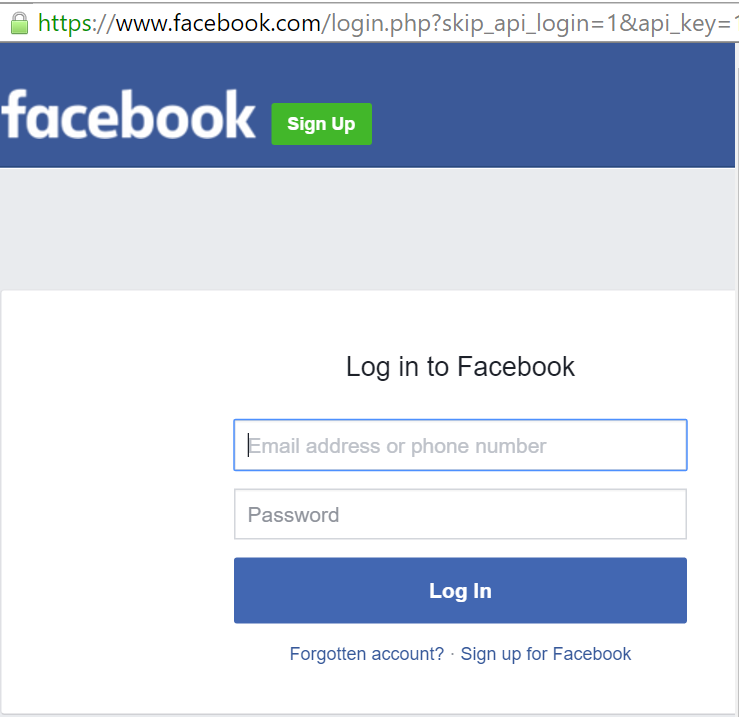

### Erforderliche Komponenten
- [Facebook](https://www.facebook.com/) -Konto 

Bevor Sie Ihr Facebook-Konto in einer app Logik verwenden können, müssen Sie die app Logik eine Verbindung mit Ihrem Konto Facebook autorisieren. Glücklicherweise können Sie ganz einfach aus innerhalb der app Logik im Portal Azure ausführen. 

Hier werden die Schritte zum Autorisieren Ihre Logik app zu Ihrer Facebook-Konto herzustellen:

1. Um eine Verbindung mit Facebook, in dem Logik app-Designer erstellen, wählen Sie in der Dropdownliste aus **Microsoft anzeigen verwaltete APIs** dann geben Sie *Facebook* in das Suchfeld ein. Wählen Sie den oder die Aktion, die Sie verwenden möchten, werden:  
  
2. Wenn Sie alle Verbindungen mit Facebook, bevor Sie erstellt haben, werden angezeigt wird, geben Sie Ihre Anmeldeinformationen Facebook. Diese Anmeldeinformationen verwendet werden, Ihre app Logik Verbindung zu autorisieren, und Zugriff auf Ihr Facebook-Konto-Daten:  
  
3. Bieten Sie Ihren Facebook-Benutzernamen und Ihr Kennwort ein, um Ihre app Logik zu autorisieren:  
     
4. Beachten Sie die Verbindung eingerichtet wurde, und Sie können jetzt mit den anderen Schritten in der app Logik fortfahren:  
     
