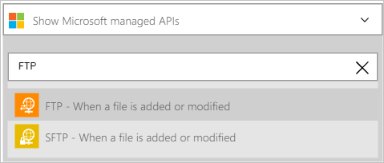

### Erforderliche Komponenten

- Ein [FTP-](https://wikipedia.org/wiki/File_Transfer_Protocol) Konto  

Bevor Sie Ihre FTP-Konto in einer app Logik verwenden können, müssen Sie die Verbindung mit Ihrem Kontos FTP-Logik app autorisieren. Glücklicherweise können Sie ganz einfach aus innerhalb der app Logik im Portal Azure ausführen.  

Hier sind die Schritte zum Autorisieren Ihre app Logik zu Ihrem FTP-Konto herzustellen:  
1. Um eine Verbindung mit FTP, in dem Logik app-Designer erstellen, wählen Sie in der Dropdownliste aus **Microsoft anzeigen verwaltete APIs** dann geben Sie *FTP* in das Suchfeld ein. Wählen Sie den oder die Aktion, die Sie verwenden möchten, werden:  
  
2. Wenn Sie alle Verbindungen mit FTP vor erstellt haben, wird angezeigt wird, geben Sie Ihre FTP-Anmeldeinformationen. Diese Anmeldeinformationen verwendet werden, Ihre app Logik Verbindung zu autorisieren, und Sie Zugriff auf Ihr Konto FTP-Daten:  
  
3. Beachten Sie die Verbindung eingerichtet wurde, und Sie können jetzt mit den anderen Schritten in der app Logik fortfahren:  
   
