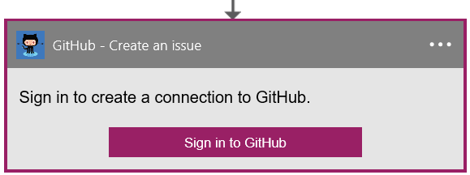

### Erforderliche Komponenten
- Ein [GitHub](http://GitHub.com) -Konto 

Bevor Sie Ihr Konto GitHub in einer app Logik verwenden können, müssen Sie die Verbindung mit Ihrem Konto GitHub Logik app autorisieren. Glücklicherweise können Sie ganz einfach aus innerhalb der app Logik im Portal Azure ausführen. 

Hier sind die Schritte aus, um Ihre app Logik eine Verbindung mit Ihrem Konto GitHub autorisieren ein:

1. Um eine Verbindung mit GitHub, in dem Logik app-Designer erstellen, wählen Sie in der Dropdownliste aus **Microsoft anzeigen verwaltete APIs** und dann geben Sie *GitHub* in das Suchfeld ein. Wählen Sie den oder die Aktion, die Sie verwenden möchten, werden:  
  
2. Wenn Sie alle Verbindungen mit GitHub, bevor Sie erstellt haben, werden angezeigt wird, geben Sie Ihre Anmeldeinformationen GitHub. Diese Anmeldeinformationen verwendet werden, Ihre app Logik Verbindung zu autorisieren, und Sie Zugriff auf Ihr Konto GitHub Daten:  
  
3. Bieten Sie Ihren GitHub-Benutzernamen und Ihr Kennwort ein, um Ihre app Logik zu autorisieren:  
     
4. Bestätigen Sie Ihre Absichten:  
     
5. Beachten Sie, dass die Verbindung im Portal erstellt wurde. Sie können nun mit die Logik app erstellen und Verwenden von GitHub darin fortfahren:   
     
