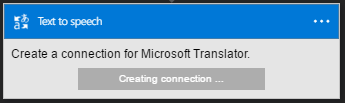

### Erforderliche Komponenten

- Ein [MicrosoftTranslator](https://www.microsoft.com/translator) -Konto  

Bevor Sie Ihr Konto MicrosoftTranslator in einer app Logik verwenden können, müssen Sie die Verbindung mit Ihrem Konto MicrosoftTranslator Logik app autorisieren. Glücklicherweise können Sie ganz einfach aus innerhalb der app Logik im Portal Azure ausführen.  

Hier sind die Schritte aus, um Ihre app Logik eine Verbindung mit Ihrem Konto MicrosoftTranslator autorisieren ein:  
1. Um eine Verbindung mit MicrosoftTranslator, in dem Logik app-Designer erstellen, wählen Sie in der Dropdownliste aus **Microsoft anzeigen verwaltete APIs** und dann geben Sie *MicrosoftTranslator* in das Suchfeld ein. Wählen Sie den oder die Aktion, die Sie verwenden möchten, werden:  
  
2. Wenn Sie alle Verbindungen mit MicrosoftTranslator, bevor Sie erstellt haben, werden angezeigt wird, geben Sie Ihre Anmeldeinformationen MicrosoftTranslator. Diese Anmeldeinformationen verwendet werden, Ihre app Logik Verbindung zu autorisieren, und Sie Zugriff auf Ihr Konto MicrosoftTranslator Daten:  
  
3. Beachten Sie die Verbindung eingerichtet wurde, und Sie können jetzt mit den anderen Schritten in der app Logik fortfahren:  
   
