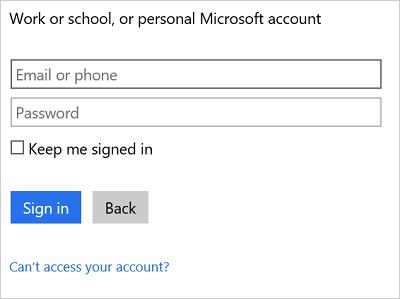

#### Erforderliche Komponenten
- Ein Azure-Konto; Sie können ein [kostenloses Konto](https://azure.microsoft.com/free) erstellen.
- Ein [Office 365](https://office365.com) -Konto  

Autorisieren Sie, bevor Ihr Office 365-Konto in einer app Logik verwenden, die app Logik zu Ihrem Office 365-Konto herzustellen. Hierzu können Sie einfach in der app Logik im Azure-Portal.  

Zustimmen möchten Sie Ihre app Logik für die Verbindung mit Ihrem Office 365-Konto mithilfe der folgenden Schritte aus:

1. Erstellen einer app Logik. Im Logik Apps-Designer wählen Sie in der Dropdown-Liste **anzeigen Microsoft verwaltete APIs** aus, und geben Sie "Office 365" in das Suchfeld. Wählen Sie eine der Trigger oder Aktionen aus:  
      

2. Wenn Sie alle Verbindungen mit Office 365 zuvor erstellt haben, werden Sie aufgefordert, melden Sie sich mit Ihrem Office 365-Anmeldeinformationen:  
      

3. Wählen Sie **Anmelden**aus, und geben Sie Ihren Benutzernamen und Ihr Kennwort ein. Wählen Sie **Anmelden**aus:  
    

    Diese Anmeldeinformationen werden verwendet, um Ihre app Logik zum Herstellen einer Verbindung mit und Zugreifen auf Ihr Office 365-Konto zu autorisieren. 

4. Beachten Sie, dass die Verbindung erstellt wurde. Jetzt, fahren Sie mit den Schritten in Ihrer app Logik:   
      
  