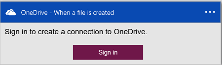
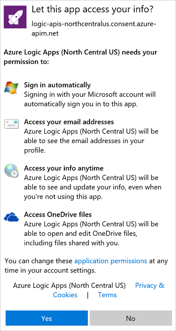

#### Erforderliche Komponenten
- Ein Azure-Konto; Sie können ein [kostenloses Konto](https://azure.microsoft.com/free) erstellen.
- Ein [OneDrive](https://www.microsoft.com/store/apps/onedrive/9wzdncrfj1p3) -Konto 

Bevor Sie Ihre OneDrive-Konto in einer app Logik verwenden können, autorisieren Sie die app Logik zu Ihrem OneDrive-Konto herzustellen.  Hierzu können Sie einfach in der app Logik im Azure-Portal. 

Zustimmen möchten Sie Ihre app Logik Verbindung zu Ihrem OneDrive-Konto mithilfe der folgenden Schritte aus:

1. Erstellen einer app Logik. Im Logik Apps-Designer wählen Sie in der Dropdown-Liste **anzeigen Microsoft verwaltete APIs** aus, und geben Sie "Onedrive" in das Suchfeld. Wählen Sie eine der Trigger oder Aktionen aus:  
  
2. Wenn Sie alle Verbindungen mit OneDrive zuvor erstellt haben, werden Sie aufgefordert, melden Sie sich mit Ihrem OneDrive-Anmeldeinformationen:  
  
3. Wählen Sie **Anmelden**aus, und geben Sie Ihren Benutzernamen und Ihr Kennwort ein. Wählen Sie **Anmelden**aus:  
     

    Diese Anmeldeinformationen werden verwendet, zu autorisieren Ihre app Logik zum Herstellen einer Verbindung mit und die Daten in Ihrem OneDrive-Konto zugreifen. 
4. Wählen Sie auf **Ja,** um zu die app Logik mit Ihrem Konto OneDrive genehmigen:  
     
5. Beachten Sie, dass die Verbindung erstellt wurde. Jetzt, fahren Sie mit den Schritten in Ihrer app Logik:  
  
