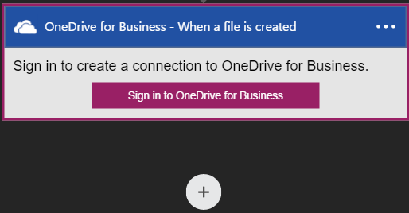
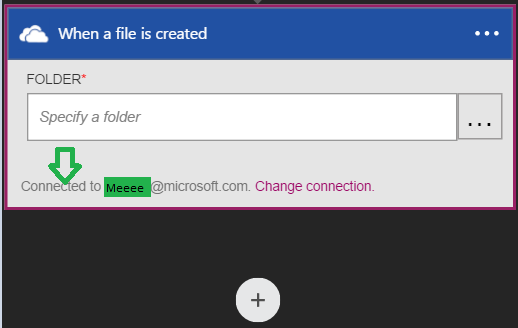

### Erforderliche Komponenten
- Ein [OneDrive](http://OneDrive.com) -Konto 

Bevor Sie Ihre OneDrive for Business-Konto in einer app Logik verwenden können, müssen Sie die Logik app zu Ihrer OneDrive for Business-Konto eine Verbindung zu autorisieren. Glücklicherweise können Sie ganz einfach aus innerhalb der app Logik im Portal Azure ausführen. 

Hier sind die Schritte zum Autorisieren Ihre app Logik für die Verbindung zu Ihrem OneDrive for Business-Konto aus:

1. Um eine Verbindung zu OneDrive for Business, in dem Logik app-Designer erstellen, wählen Sie in der Dropdownliste aus **Microsoft anzeigen verwaltete APIs** und dann geben Sie *OneDrive for Business* in das Suchfeld ein. Wählen Sie den oder die Aktion, die Sie verwenden möchten, werden:  
  
2. Wenn Sie alle Verbindungen mit OneDrive for Business, bevor Sie erstellt haben, werden Sie aufgefordert Abrufen Ihrer OneDrive Business Anmeldeinformationen hinzufügen. Diese Anmeldeinformationen verwendet werden, Ihre app Logik Verbindung zu autorisieren, und Ihrer OneDrive for Business-Konto Daten zugreifen:  
  
3. Bereitstellen Sie Ihrer OneDrive for Business-Benutzernamen und Ihr Kennwort ein, um Ihre app Logik zu autorisieren:  
     
4. Beachten Sie die Verbindung eingerichtet wurde, und Sie können jetzt mit den anderen Schritten in der app Logik fortfahren:  
     
