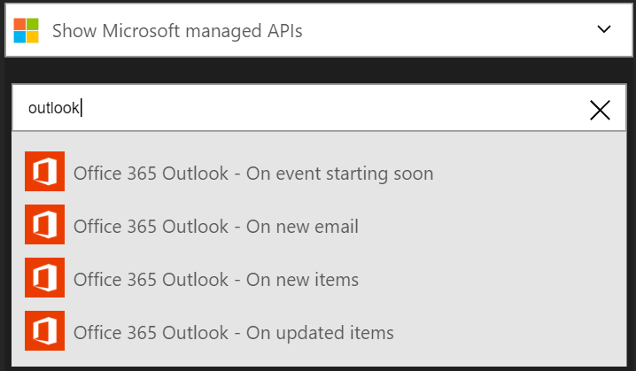

## Verbinden mit Outlook.com

### Erforderliche Komponenten
- Ein Outlook.com-Konto

Bevor Sie Ihr Outlook.com-Konto in einer app Logik verwenden können, müssen Sie die app Logik Verbindung zu Ihrem Outlook.com-Konto autorisieren. Glücklicherweise können Sie ganz einfach aus innerhalb der app Logik im Portal Azure ausführen. 

Hier werden die Schritte zum Autorisieren Ihre app Logik zu Ihrem Outlook.com-Konto herzustellen:

1. Alle Logik apps müssen von einem Trigger gestartet werden, nachdem Sie Ihre app Logik, die-Designer wird geöffnet erstellen und zeigt eine Liste der auslöst, Sie können mithilfe die Logik app starten:

  
2. Geben Sie "Outlook" in das Suchfeld ein. Beachten Sie, dass die Liste gefiltert wird, um eine Liste aller Trigger mit "Outlook" in den Namen ein:
3. Wählen Sie **Office 365 - Outlook auf neue e-Mail-Nachricht**ein.   
  Wenn Sie alle Verbindungen mit Outlook bereits erstellt haben, werden angezeigt wird, geben Sie Ihre Anmeldeinformationen Outlook.com. Diese Anmeldeinformationen verwendet werden, Ihre app Logik Verbindung zu autorisieren, und Zugriff auf Ihr Outlook.com-Konto-Daten:
4. Geben Sie Ihre Anmeldeinformationen für Outlook, und melden Sie sich an:  
  Das war's auch. Sie haben nun eine Verbindung mit Outlook erstellt. Diese Verbindung stehen zur Verwendung in eine beliebige andere Logik app zur Verfügung, die Sie erstellen.

