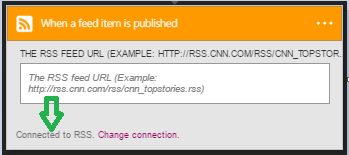

### Erforderliche Komponenten

- Ein [RSS](https://wikipedia.org/wiki/RSS) -Konto  

Bevor Sie Ihr Konto RSS in einer app Logik verwenden können, müssen Sie die Verbindung mit Ihrem Konto RSS-Logik app autorisieren. Glücklicherweise können Sie ganz einfach aus innerhalb der app Logik im Portal Azure ausführen.  

Hier sind die Schritte zum Autorisieren Ihre app Logik zu Ihrem RSS-Konto herzustellen:  
1. Um eine Verbindung mit RSS, in dem Logik app-Designer erstellen, wählen Sie in der Dropdownliste aus **Microsoft anzeigen verwaltete APIs** und dann geben Sie *RSS* in das Suchfeld ein. Wählen Sie den oder die Aktion, die Sie verwenden möchten, werden:  
  
2. Wählen Sie die **Verbindung erstellen** :  
  
3. Beachten Sie die Verbindung eingerichtet wurde, und Sie können jetzt mit den anderen Schritten in der app Logik fortfahren:  
   
