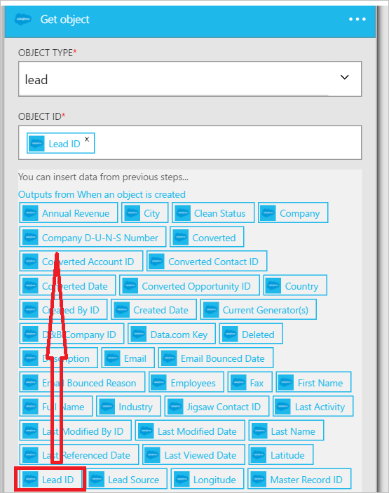

Jetzt, da Sie eine Bedingung hinzugefügt haben, interessante es ist Zeit für einen Vorgang ausführen mit den Daten, die vom Trigger generiert wird. Wie folgt vor, um die Aktion **Vertrieb - Get-Objekt** hinzuzufügen. Diese Aktion erhalten die Daten jedes Mal, die ein neuer Lead erstellt wird. Sie werden auch eine zweite Aktion hinzufügen, die die Daten aus den Vertrieb - Abrufen einer Objektaktion, senden eine e-Mail-Nachricht mithilfe des Office 365-Verbinders verwendet werden.  

So konfigurieren Sie diese Aktion, müssen die folgende Informationen bereitzustellen. Sie können feststellen, dass es benutzerfreundliche Daten als Eingabe für einige der Eigenschaften für die neue Datei vom Trigger generiert:

|Erstellen von Dateieigenschaft|Beschreibung|
|---|---|
|Objekttyp|Dies ist der Typ des Vertrieb-Objekts, das Sie interessiert. Beispiele für sind Lead, Firma, usw. an.|
|Objekt-ID|Dies ist einen Bezeichner für das Objekt aus.|

1. Wählen Sie Hyperlink **Hinzufügen eine Aktion** aus. Dieses wird geöffnet, die im Suchfeld, in dem Sie für jede Aktion suchen können, ausführen möchten. In diesem Beispiel sind Vertrieb Aktionen von Interesse.      
  
- Geben Sie *Vertrieb* zu suchenden Aktionen im Zusammenhang mit Vertrieb.
- Wählen Sie **Vertrieb - Get-Objekt** als die auszuführende Aktion aus.   **Hinweis**: werden Sie aufgefordert, autorisieren Ihre app Logik zu Ihrem Konto Vertrieb zugreifen, wenn Sie nicht bereits getan haben.    
    
- Das **erste Objekt** -Steuerelement wird geöffnet.  
- Wählen Sie als Objekttyp *führen* .
- Wählen Sie das **Objekt-ID** -Steuerelement.
- Wählen Sie **...** , um die Liste der Token zu erweitern, die als Eingabe für Aktionen verwendet werden können.       
    
- SELECT- **Kennung** -Steuerelement wird geöffnet.   
     
- Beachten Sie, dass das Lead-ID-Token jetzt in der Objekt-ID-Steuerelement ist, die angibt, dass die Get-Objektaktion für einen Lead eine ID, die durchsucht werden, die die Lead-ID des Lead gleich ist, die diese app Logik ausgelöst wurde.  
  
- Speichern Sie Ihrer Arbeit an. Das war's auch, die erste Objektaktion Ihre app Logik hinzugefügt haben. Das erste Objekt Steuerelement sollte wie folgt aussehen:    
  

Jetzt, da Sie eine Aktion aus, um einen Lead erhalten hinzugefügt haben, möchten Sie möglicherweise den neu erstellten Lead interessante Aktionen ausführen. In einem Unternehmen möchten Sie möglicherweise per e-Mail an einer Verteilerliste benachrichtigt, dass ein neuer Lead erstellt wurde. Wir verwenden des Office 365-Verbinders, senden eine e-Mail-Nachricht mit einigen der relevanten Informationen aus dem neuen Lead Objekt in Vertrieb.  

1. Wählen Sie **Hinzufügen eine Aktion** aus, und klicken Sie dann in das Suchfeld Steuerelement geben Sie *e-Mail-Adresse ein* . Dies filtert die Aktionen, die zum Senden und Empfangen von e-Mails verwandt sind.  
- Wählen Sie das Element in der **Office 365 Outlook - eine e-Mail zu senden** . Wenn Sie bereits eine *Verbindung* mit Ihrem Office 365-Konto erstellt haben, werden Sie aufgefordert werden, geben Sie Ihre Anmeldeinformationen ein Office 365, um es jetzt zu erstellen. Wenn Sie fertig sind, wird das Steuerelement zum **Senden einer e-Mail** geöffnet.        
  
- Geben Sie die e-Mail-Adresse, die Sie e-Mails in das Steuerelement **zu** senden möchten.
-  Im **Betreff** -Steuerelement geben Sie die *neuen Lead erstellt* - und wählen Sie dann das *Unternehmen* Token. Dadurch wird das Feld *Unternehmen* aus den neuen Lead erstellt in Vertrieb angezeigt.  
-  In den **Textkörper** -Steuerelement können Sie eines der Token vom neuen Lead Objekt auswählen, und Sie können auch Geben Sie jeden Text, der im Textkörper der e-Mail angezeigt werden soll. Hier ist ein Beispiel:  
   
- Speichern Sie den Workflow an.  

Das war's auch. Ihre app Logik ist abgeschlossen.  

Nun können Sie Ihre app Logik testen: in Vertrieb, erstellen Sie einen neuen Lead, das die Bedingung erfüllt Sie erstellt haben.  Wenn Sie diese exemplarische Vorgehensweise vollständig befolgt haben, erstellen Sie einfach einen so genannter Lead mit einer e-Mail-Adresse, die *amazon.com* darin enthält. Nach ein paar Sekunden Ihre app Logik ausgelöst werden soll, und die Ergebnisse möglicherweise ungefähr wie folgt aussehen:  
  

