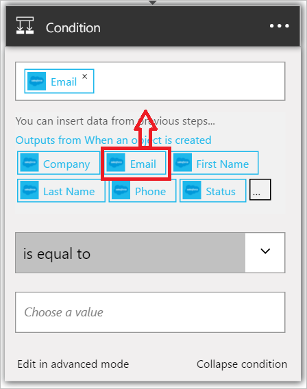

Diese Bedingung wird das Feld e-Mail-Adresse für jeden neuen Vertrieb Lead ausgewertet werden. Wenn die e-Mail-Adresse *amazon.com*enthält, wird das Ergebnis der Bedingung *erfüllt*werden.

1. Wählen Sie **+ neuen Schritt**aus.  
   
- Wählen Sie **Hinzufügen einer Bedingung**aus.    
  
- Wählen Sie **auswählen einen Wert**aus.    
  
- Wählen Sie das *E-Mail* -Token aus den Lead des Triggers.    
  
- Wählen Sie *enthält*.      
  
- Wählen Sie **auswählen einen Wert** am unteren Rand des Steuerelements.     
  
- Geben Sie *amazon.com* als Wert die e-Mail-Adresse für den neuen Lead ausgewertet werden soll. Wenn die e-Mail-Adresse *amazon.com*enthält, wird die Bedingung zu *Wahr* ausgewertet wird, und die anderen Schritte in der app Logik fortgesetzt werden können.    
  
- Speichern Sie Ihre Logik apps.  

