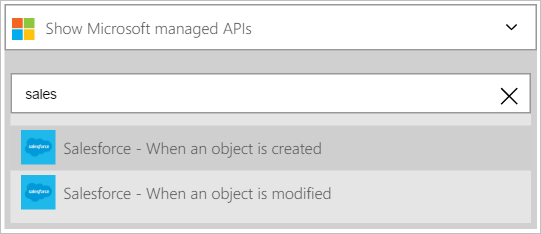

In diese exemplarische Vorgehensweise erfahren Sie, wie Sie mithilfe den Trigger **Vertrieb - beim Erstellen ein Objekts** ein app-Workflows Logik initiieren beim Erstellen ein neues Leads in Ihrer Vertrieb.

>[AZURE.NOTE]Sie werden aufgefordert erhalten, melden Sie sich bei Ihrem Konto Vertrieb, wenn Sie eine *Verbindung* mit Vertrieb nicht bereits erstellt haben.  

1. Geben Sie *Vertrieb* in das Suchfeld ein, auf dem Logik apps-Designer, und wählen Sie den Trigger **Vertrieb – Wenn Sie ein Objekt erstellt wird** .  
   
- Das Steuerelement **beim Erstellen ein Objekts** wird angezeigt.  
   
- Wählen Sie den **Objekttyp** , und klicken Sie dann in der Liste der Objekte markieren Sie *führen* . In diesem Schritt bestätigen Sie, dass Sie einen Trigger erstellen, der Ihre app Logik benachrichtigen wird, wenn ein neuer Lead in Vertrieb erstellt wird.   
   
- Das war's auch. Sie haben den Trigger erstellt. Jedoch müssen Sie mindestens eine Aktion um anlegen eine gültigen Logik app erstellen.    
   

Zu diesem Zeitpunkt wurde die app Logik zu einem Trigger konfiguriert, die in eine Abfolge von anderen Trigger und Aktionen in dem Workflow beginnen, wenn ein neues Element in der Vertrieb erstellt wird.  