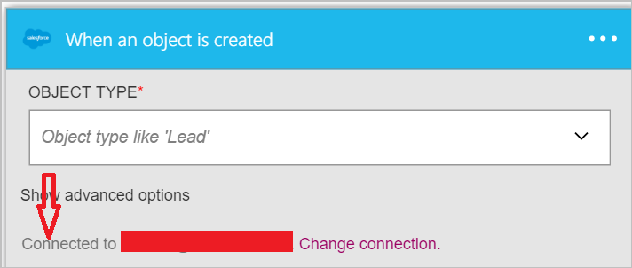

### Erforderliche Komponenten

- Ein Konto [Vertrieb](https://salesforce.com)  

Bevor Sie Ihr Konto Vertrieb in einer app Logik verwenden können, müssen Sie die Verbindung mit Ihrem Konto Vertrieb Logik app autorisieren. Glücklicherweise können Sie einfach aus innerhalb der app Logik im Portal Azure ausführen.  

Hier sind die Schritte aus, um Ihre app Logik eine Verbindung mit Ihrem Konto Vertrieb autorisieren ein:  
1. Um eine Verbindung mit Vertrieb, in dem Logik app-Designer erstellen, wählen Sie in der Dropdownliste aus **Microsoft anzeigen verwaltete APIs** und dann geben Sie *Vertrieb* in das Suchfeld ein. Wählen Sie den oder die Aktion, die Sie verwenden möchten, werden:  
  
2. Wenn Sie alle Verbindungen mit Vertrieb, bevor Sie erstellt haben, werden angezeigt wird, geben Sie Ihre Anmeldeinformationen Vertrieb. Diese Anmeldeinformationen verwendet werden, Ihre app Logik Verbindung zu autorisieren, und Sie Zugriff auf Ihr Konto Vertrieb Daten:  
  
3. Bieten Sie Ihren Vertrieb-Benutzernamen und Ihr Kennwort ein, um Ihre app Logik zu autorisieren:  
   
4. Lassen Sie uns Verbindung zum Vertrieb zu:  
  
5. Beachten Sie die Verbindung eingerichtet wurde, und Sie können jetzt mit den anderen Schritten in der app Logik fortfahren:  
  
