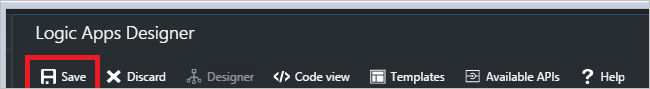

Jetzt, da Sie einen Trigger hinzugefügt haben, ist es Zeit, etwas interessanter mit den Daten zu tun, die vom Trigger generiert wird. Wie folgt vor, um die Aktion **Dienstbus - Nachricht senden** hinzuzufügen. Diese Aktion sendet eine Nachricht an Dienstbus.  

Wie folgt vor, um die Aktion der senden-Nachricht zu erstellen:  

1. Wählen Sie **+ neuen Schritt** die Aktion hinzufügen.  
- Wählen Sie **eine Aktion hinzufügen**. Dieses wird geöffnet, die ein Suchfeld, in dem Sie für jede Aktion suchen können ausführen möchten. In diesem Beispiel sind Dienstbus Aktionen von Interesse.    
   
- Geben Sie *Dienstbus*aus.  
- Wählen Sie **Dienstbus - Nachricht senden** als die auszuführende Aktion aus.  
    
- Geben Sie den Inhalt der Nachricht ein. Dies ist erforderlich.  
- Geben Sie den Warteschlange oder Thema, dem die Nachricht gesendet wird. Dies ist auch erforderlich.   
- Geben Sie weitere Informationen über die Nachricht ein. Dies ist optional.     
    
- Speichern der Änderungen auf den Workflow.   
     
