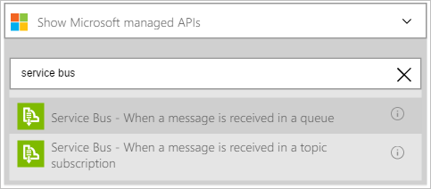
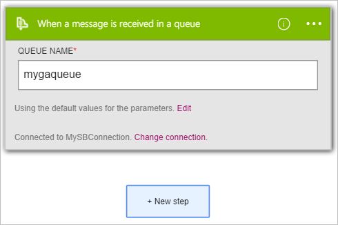

So sieht wie den Trigger **Dienstbus – Wenn Sie eine Nachricht in einer Warteschlange empfangen wird** mithilfe um einen Logik app Workflow zu starten, wenn ein neues Element an einer Dienstbus Warteschlange gesendet wird.  

>[AZURE.NOTE]Sie werden aufgefordert, sich mit Ihrer Dienstbus Verbindungszeichenfolge, wenn Sie eine Verbindung mit Dienstbus nicht bereits erstellt haben.  

1. Geben Sie im Suchfeld den Logik apps-Designer **Dienstbus**aus. Wählen Sie dann den Trigger **Dienstbus – Wenn Sie eine Nachricht in einer Warteschlange empfangen wird** .  
   
- Das Dialogfeld **, wenn eine Nachricht in einer Warteschlange eingeht** , wird angezeigt.  
   
- Geben Sie den Namen der Warteschlange Dienstbus den Trigger zu überwachen soll.   
   

An diesem Punkt wurde die app Logik zu einem Trigger konfiguriert. Wenn ein neues Element in der Warteschlange, die Sie ausgewählt haben eingeht, wird der Trigger in eine Abfolge von anderen Trigger und Aktionen in dem Workflow gestartet.    
