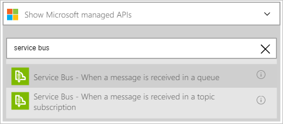

### Erforderliche Komponenten

Sie müssen ein [Dienstbus](https://azure.microsoft.com/services/service-bus/) -Konto verfügen.  

Bevor Sie Ihr Konto Azure-Dienstbus in einer app Logik verwenden können, müssen Sie die app Logik Verbindung zu Ihrem Bus Dienstkonto autorisieren. Glücklicherweise können Sie einfach aus innerhalb der app Logik im Azure-Portal ausführen.  

Hier sind die Schritte aus, um Ihre app Logik eine Verbindung mit Ihrem Konto Dienstbus autorisieren ein:  

1. Wählen Sie zum Erstellen einer Verbindungs mit Dienst, in der app-Designer Logik **anzeigen Microsoft verwaltete APIs** in der Dropdown-Liste aus. Geben Sie dann **Dienstbus** in das Suchfeld ein. Wählen Sie die auslösen oder die Aktion, die Sie verwenden möchten.  
      

2. Wenn Sie alle Verbindungen mit Dienstbus vor erstellt haben, werden Sie aufgefordert, geben Sie Ihre Anmeldeinformationen Dienstbus. Diese Anmeldeinformationen werden verwendet, um Ihre app Logik zum Herstellen einer Verbindung mit und Zugriff auf Ihr Konto Dienstbus Daten zu autorisieren. Der Verbinder Dienstbus benötigt die Verbindungszeichenfolge für den Namespace Dienstbus. Darüber hinaus werden **Verwalten** von Berechtigungen erforderlich. Eine gute Möglichkeit, feststellen, ob Ihre Verbindungszeichenfolge für den Namespace ist oder eine bestimmte Entität ist, wenn es enthält die `EntityPath` Parameter. Wenn dies der Fall ist, ist es nicht die richtigen Verbindungszeichenfolge für eine app Logik.  
    

1. Nachdem Sie die Verbindungszeichenfolge für den Namespace erhalten haben, können Sie es für die Verbindung API Logik Apps.  
      

3. Beachten Sie die Verbindung eingerichtet wurde, und Sie können jetzt mit den anderen Schritten in der app Logik fortfahren.  
       
