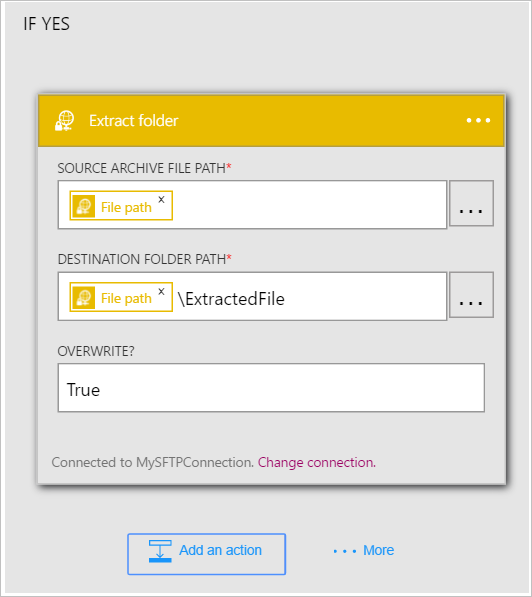

Jetzt, da Sie einen Trigger hinzugefügt haben, interessante es ist Zeit für einen Vorgang ausführen mit den Daten, die vom Trigger generiert wird. Führen Sie diese Schritte zum Hinzufügen eines der Aktion **SFTP - Ordner extrahiert werden** . Diese Aktion extrahiert den Inhalt einer Datei aus, wenn die definierte Bedingung erfüllt sind. 

So konfigurieren Sie diese Aktion, müssen die folgende Informationen bereitzustellen. Sie können feststellen, dass es benutzerfreundliche Daten als Eingabe für einige der Eigenschaften für die neue Datei vom Trigger generiert:

|SFTP - extrahieren Ordnereigenschaft|Beschreibung|
|---|---|
|Der Pfad der Archivdatei Quelle|Dies ist der Pfad für die Datei, die extrahiert werden. Sie können wählen Sie eine der Token aus einer früheren Aktion oder suchen Sie SFTP-Server, um den Dateipfad zu suchen.|
|Zielordnerpfad|Dies ist der Pfad, in dem die extrahierten Dateien platziert wird. Wählen Sie eine der Token aus einer früheren Aktion als Zielpfad oder SFTP-Server durchsuchen, und wählen Sie einen Pfad aus.|
|Überschreiben?|Zeigt an, ob eine Datei mit demselben Namen wie die extrahierten Datei im Zielordnerpfad gefunden wird, wenn die vorhandene Datei überschrieben werden soll.|

Lassen Sie uns beginnen Hinzufügen der Aktion, um die Dateien zu extrahieren, wenn die zuvor definierte Bedingung *Wahr*ausgewertet wird. 

1. Wählen Sie **eine Aktion hinzufügen**.        
   
- Wählen Sie die Aktion **SFTP - Ordner extrahieren**      
   
- Wählen Sie die **Quelle der Pfad der Archivdatei**              
   
- Wählen Sie aus der **Dateipfad** Token. Dies zeigt an, dass Sie den Dateipfad der Datei, die der Trigger gefunden als Pfad der Quelle der Archivdatei verwenden soll.           
   
- Wählen Sie **Zielordnerpfad** aus.           
   
- Wählen Sie aus der **Dateipfad** Token. Dies zeigt an, dass Sie den Dateipfad der Datei, die der Trigger gefunden als Zielpfad verwendet werden, für die extrahierten Dateien.   
- Geben Sie im Steuerelement **Zielordnerpfad** *\ExtractedFile* ein. Tun Sie dies nur nach der Datei Pfad Token im Steuerelement Ziel Ordner Pfad ein.         
   
- Geben Sie *True* in der **Überschreiben?* Steuerelement, um anzugeben, dass die vorhandene Dateien überschrieben werden sollen, wenn sie denselben Namen wie die extrahierten Dateien aufweisen.      
   
- Speichern der Änderungen auf den workflow  
