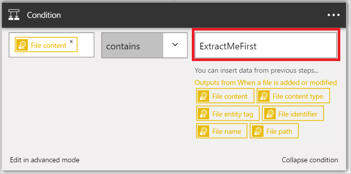

1. Wählen Sie **+ neuen Schritt** die Aktion hinzufügen.  
- Wählen Sie den Link zum **Hinzufügen einer Aktion** aus. Dieses wird geöffnet, die im Suchfeld, in dem Sie für jede Aktion suchen können, ausführen möchten. In diesem Beispiel sind SharePoint-Aktionen von Interesse.    
    
- Wählen Sie auf der linken Seite **auswählen einen Wert** aus. 
    
- Wählen Sie **-Dateiinhalt** , um anzugeben, dass der Inhalt der Datei in der Bedingung ausgewertet werden soll.      
   
- Wählen Sie in der Liste der Operatoren *enthält* .       
   
- Wählen Sie auf der rechten Seite **auswählen einen Wert** aus, und geben Sie *ExtractMeFirst*. In diesem Beispiel ist ExtractMeFirst ein Wert, der möglicherweise in einer Datei werden von Personen, die Zugriff auf den Ordner SFTP, um anzugeben, dass es sich um eine Archivdatei ist, die extrahiert werden sollen.  
   