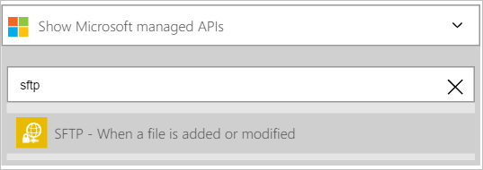
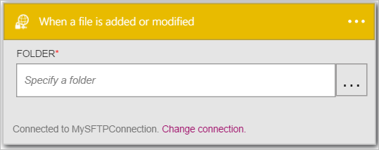

Wir fügen Sie einen Trigger hinzu.

1. Geben Sie in das Suchfeld *Sftp* auf der Logik apps Designer und wählen Sie dann den Trigger **SFTP – Wenn eine Datei hinzugefügt oder geändert wird**   
  
- Das Steuerelement **, wenn eine Datei hinzugefügt oder geändert wird** angezeigt wird  
  
- Wählen Sie die **...** befindet sich auf der rechten Seite des Steuerelements. Daraufhin wird das Ordner Datumsauswahl-Steuerelement  
  
- Wählen Sie die **SFTP** auf den Stammordner als den Ordner, um neue oder geänderte Dateien überwachen auswählen aus. Beachten Sie, dass der Stammordner des Steuerelements **Ordner** jetzt angezeigt wird.  
   

An diesem Punkt wurde die app Logik zu einem Trigger konfiguriert, die in eine Abfolge von anderen Trigger und Aktionen in dem Workflow beginnen, wenn eine Datei geändert oder in einem Ordner Wahl SFTP erstellt wird. 

>[AZURE.NOTE]Für eine app Logik funktioniert muss es mindestens ein Trigger und eine Aktion enthalten. Führen Sie die Schritte im nächsten Abschnitt, um eine Aktion hinzuzufügen.  