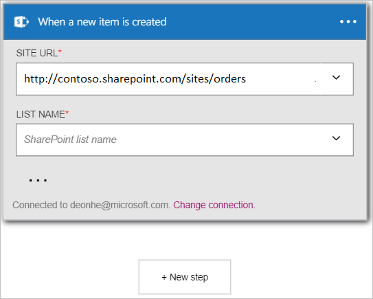

In diesem Beispiel wird aufgezeigt, wie Sie mithilfe der **SharePoint Online - beim Erstellen ein neues Elements** auslösen um einen Logik app Workflow zu starten, wenn ein neues Element in einer Liste mit SharePoint Online erstellt wird.

>[AZURE.NOTE]Sie werden aufgefordert erhalten, melden Sie sich bei Ihrem Konto SharePoint, wenn Sie eine *Verbindung* mit SharePoint Online nicht bereits erstellt haben.  

1. Geben Sie in das Suchfeld *Sharepoint* auf der Logik apps-Designer, und wählen Sie die **SharePoint Online - beim Erstellen ein neues Elements** auslösen.  
  
- Das Steuerelement **, wenn ein neues Element erstellt wird** , wird angezeigt.  
   
- Wählen Sie eine **Website-URL**ein. Dies ist der SharePoint online-Website, die Sie für neue Elemente, um den Workflow auslösen überwachen möchten.  
   
- Wählen Sie einen **Namen ein**. Dies ist der Liste auf der SharePoint Online-Website, die Sie für neue Elemente überwachen möchten, die den Workflow auslösen.  
   

An diesem Punkt wurde die app Logik zu einem Trigger konfiguriert, die in eine Abfolge von anderen Trigger und Aktionen in dem Workflow begonnen wird. Dies findet jedes Mal statt, wenn ein neues Element in SharePoint Online-Liste erstellt wird, die Sie ausgewählt haben.  