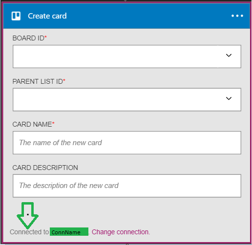

### Erforderliche Komponenten
- Ein [Trello](http://trello.com) -Konto 

Bevor Sie Ihr Konto Trello in einer app Logik verwenden können, müssen Sie die Verbindung mit Ihrem Konto Trello Logik app autorisieren. Glücklicherweise können Sie ganz einfach aus innerhalb der app Logik im Portal Azure ausführen. 

Hier sind die Schritte aus, um Ihre app Logik eine Verbindung mit Ihrem Konto Trello autorisieren ein:

1. Um eine Verbindung mit Trello, in dem Logik app-Designer erstellen, wählen Sie in der Dropdownliste aus **Microsoft anzeigen verwaltete APIs** und dann geben Sie *Trello* in das Suchfeld ein. Wählen Sie den oder die Aktion, die Sie verwenden möchten, werden:  
  
2. Wenn Sie alle Verbindungen mit Trello, bevor Sie erstellt haben, werden angezeigt wird, geben Sie Ihre Anmeldeinformationen Trello. Diese Anmeldeinformationen werden verwendet werden, um Ihre app Logik Verbindung zu autorisieren, und Zugriff auf Ihr Konto Trello Daten:  
   
3. Lassen Sie uns Verbindung zum Trello zu:  
     
4. Bieten Sie Ihren Trello-Benutzernamen und Ihr Kennwort ein, um Ihre app Logik zu autorisieren:  
    
5. Beachten Sie die Verbindung eingerichtet wurde, und Sie können jetzt mit den anderen Schritten in der app Logik fortfahren:  
  
