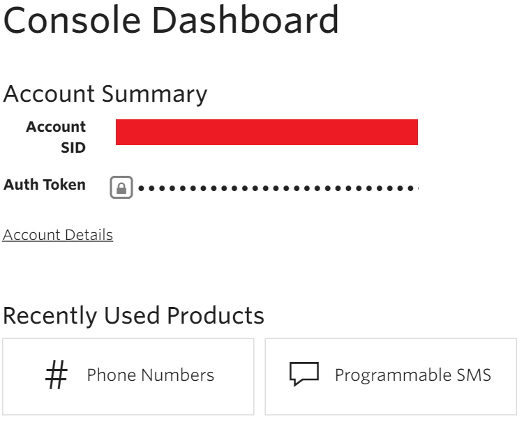

### Erforderliche Komponenten
- Ein Twilio-Konto
- Eine überprüft Twilio Telefonnummer, die empfangen von SMS
- Eine überprüft Twilio Telefonnummer, die SMS senden können

>[AZURE.NOTE] Wenn Sie ein Testkonto Twilio verwenden, können Sie nur SMS zu Telefonnummern **überprüft** senden.  

Bevor Sie Ihr Konto Twilio in einer app Logik verwenden können, müssen Sie die Verbindung mit Ihrem Konto Twilio Logik app autorisieren. Glücklicherweise können Sie ganz einfach aus innerhalb der app Logik im Portal Azure ausführen. 

Hier sind die Schritte aus, um Ihre app Logik eine Verbindung mit Ihrem Konto Twilio autorisieren ein:

1. Um eine Verbindung mit Twilio, in dem Logik app-Designer erstellen, wählen Sie in der Dropdownliste aus **Microsoft anzeigen verwaltete APIs** und dann geben Sie *Twilio* in das Suchfeld ein. Wählen Sie den oder die Aktion, die Sie verwenden möchten, werden:  
  
2. Wenn Sie alle Verbindungen mit Twilio, bevor Sie erstellt haben, werden angezeigt wird, geben Sie Ihre Anmeldeinformationen Twilio. Diese Anmeldeinformationen verwendet werden, Ihre app Logik Verbindung zu autorisieren, und Sie Zugriff auf Ihr Konto Twilio Daten:  
    
3. Sie benötigen die **Twilio Konto-Id** und **Twilio Access Token** aus dem Dashboard in Twilio, also melden Sie sich bei Ihrem Twilio Konto nun zum Extrahieren der folgenden zweierlei Informationen:  
    
4. Twilio und Logik apps verwenden unterschiedliche Namen, um diese zweierlei Informationen zu identifizieren. Hier ist, wie Sie das Dialogfeld Logik apps zuordnen müssen:  
5. Wählen Sie die Schaltfläche **Verbindung erstellen** :  
  
6. Beachten Sie die Verbindung eingerichtet wurde, und Sie können jetzt mit den anderen Schritten in der app Logik fortfahren:  
  