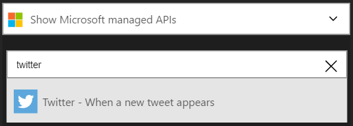
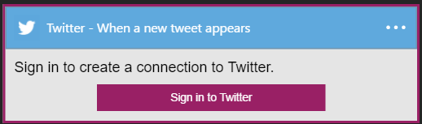
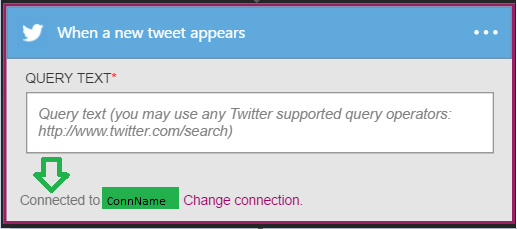

### Erforderliche Komponenten
- Twitter-Konto 

Bevor Sie Ihr Twitter-Konto in einer app Logik verwenden können, müssen Sie die Verbindung mit Ihrem Konto Twitter Logik app autorisieren. Glücklicherweise können Sie einfach aus innerhalb der app Logik im Portal Azure ausführen. 

Hier sind die Schritte zum Autorisieren Ihre app Logik zu Ihrem Twitter-Konto herzustellen:

1. Zum Erstellen einer Verbindungs mit Twitter, in der app-Designer Logik wählen Sie in der Dropdownliste aus **Microsoft anzeigen verwaltete APIs** und dann in das Suchfeld Geben Sie *Twitter ein* . Wählen Sie den oder die Aktion, die Sie verwenden möchten, werden:  
  
2. Wenn Sie alle Verbindungen mit Twitter vor erstellt haben, werden angezeigt wird, geben Sie Ihre Anmeldeinformationen Twitter. Diese Anmeldeinformationen verwendet werden, Ihre app Logik Verbindung zu autorisieren, und Zugriff auf Ihr Twitter-Konto-Daten:  
    
3. Bieten Sie Ihren Twitter-Benutzernamen und Ihr Kennwort ein, um Ihre app Logik zu autorisieren:  
    
4. Bestätigen Sie Ihre Autorisierung:  
    
6. Beachten Sie die Verbindung eingerichtet wurde, und Sie können jetzt mit den anderen Schritten in der app Logik fortfahren:  
  