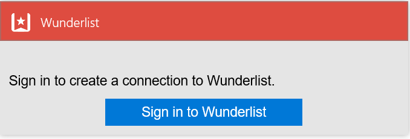
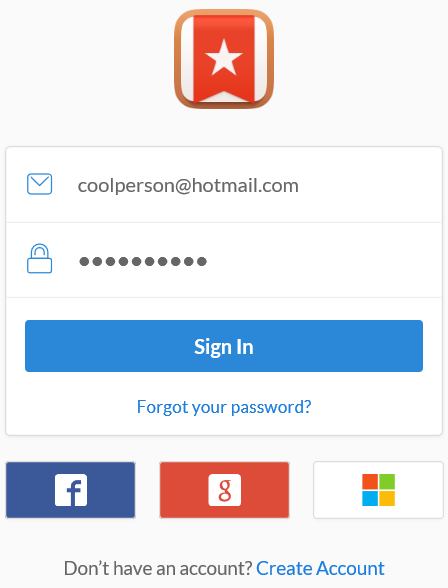

### Erforderliche Komponenten
- Ein Wunderlist-Konto  

Bevor Sie Ihr Konto Wunderlist in einer app Logik verwenden können, müssen Sie die Verbindung mit Ihrem Konto Wunderlist Logik app autorisieren. Glücklicherweise können Sie ganz einfach aus innerhalb der app Logik im Portal Azure ausführen. 

Hier sind die Schritte aus, um Ihre app Logik eine Verbindung mit Ihrem Konto Wunderlist autorisieren ein:

1. Um eine Verbindung mit Wunderlist, in dem Logik app-Designer erstellen, wählen Sie in der Dropdownliste aus **Microsoft anzeigen verwaltete APIs** und dann geben Sie *Wunderlist* in das Suchfeld ein. Wählen Sie den oder die Aktion, die Sie verwenden möchten, werden:  
  
2. Wenn Sie alle Verbindungen mit Wunderlist, bevor Sie erstellt haben, werden angezeigt wird, geben Sie Ihre Anmeldeinformationen Wunderlist. Diese Anmeldeinformationen verwendet werden, Ihre app Logik Verbindung zu autorisieren, und Sie Zugriff auf Ihr Konto Wunderlist Daten:   
    
2. Geben Sie Ihre Anmeldeinformationen, und wählen Sie die Schaltfläche zur Anmeldung  
    
3. Sie werden dann was die app Logik mit Ihrem Konto Wunderlist Berechtigungen verfügen wird erklärt werden. Wenn Sie zustimmen, wählen Sie die Schaltfläche, um Ihr Einverständnis damit aus. 
    
4. Wählen Sie schließlich die Schaltfläche **Autorisieren**  
    

