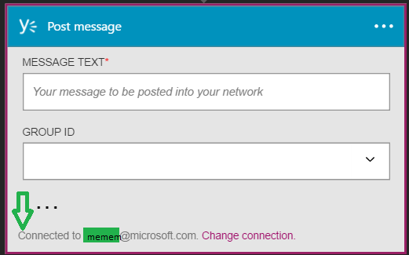

### Erforderliche Komponenten
- [Yammer](https://www.yammer.com/) -Konto 

Bevor Sie Ihre Yammer-Konto in einer app Logik verwenden können, müssen Sie die app Logik Verbindung zu Ihrem Yammer-Konto autorisieren. Glücklicherweise können Sie ganz einfach aus innerhalb der app Logik im Portal Azure ausführen. 

Hier werden die Schritte zum Autorisieren Ihre app Logik zu Ihrem Yammer-Konto herzustellen:

1. Zum Erstellen einer Verbindungs mit Yammer, in der app-Designer Logik wählen Sie in der Dropdownliste aus **Microsoft anzeigen verwaltete APIs** und dann in das Suchfeld Geben Sie *Yammer ein* . Wählen Sie den oder die Aktion, die Sie verwenden möchten, werden:  
  
2. Wenn Sie alle Verbindungen mit Yammer, bevor Sie erstellt haben, werden angezeigt wird, geben Sie Ihre Anmeldeinformationen Yammer. Diese Anmeldeinformationen verwendet werden, Ihre app Logik Verbindung zu autorisieren, und Zugriff auf Ihre Yammer-Konto-Daten:  
  
3. Bieten Sie Ihren Yammer-Benutzernamen und Ihr Kennwort ein, um Ihre app Logik zu autorisieren:  
     
4. Beachten Sie die Verbindung eingerichtet wurde, und Sie können jetzt mit den anderen Schritten in der app Logik fortfahren:  
     
