In diesem Handbuch wird gezeigt, wie Sie [ClearDB] zum Erstellen einer MySQL-Datenbank aus dem Azure-Speicher und zum Erstellen einer MySQL-Datenbank als eine verknüpfte Ressource, beim Erstellen einer [Website Azure] [ waws] . [ClearDB] ist ein Fehlertoleranz Datenbank-als-Service-Anbieter, der Sie ausführen, und MySQL-Datenbanken in Azure Rechenzentren verwalten, und verbinden sie aus einer anderen Anwendung ermöglicht.  

> [AZURE.NOTE] Wenn Sie als Teil der Website Erstellungsprozess eine MySQL-Datenbank erstellen, können Sie nur eine kostenlose Datenbank erstellen. Erstellen einer MySQL-Datenbank aus dem Azure-Speicher, können Sie eine kostenlose Datenbank erstellen oder eine Auswahl treffen kostenpflichtiges Optionen.

## So: erstellen eine MySQL-Datenbank aus dem Azure-Speicher

Zum Erstellen einer MySQL-Datenbank aus dem Azure-Speicher folgendermaßen Sie vor:

1. Melden Sie sich bei der [Azure-Verwaltungsportal][portal].
2. Klicken Sie auf **+ neue** am unteren Rand der Seite, und wählen Sie dann **MARKETPLACE**.

    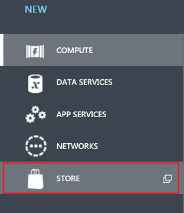

3. Wählen Sie **ClearDB MySQL-Datenbank**, und klicken Sie auf den Pfeil am Fuß des Rahmens.

    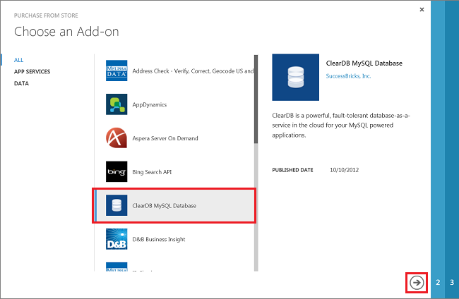

4. Wählen Sie einen Plan aus, geben Sie einen Datenbanknamen, wählen Sie einen Bereich, und klicken Sie auf den Pfeil am Fuß des Rahmens.

    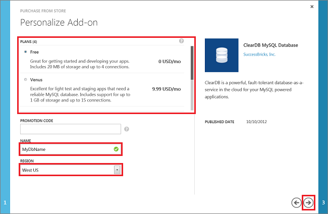

5. Klicken Sie auf das Häkchen, um Ihren Kauf abzuschließen.

    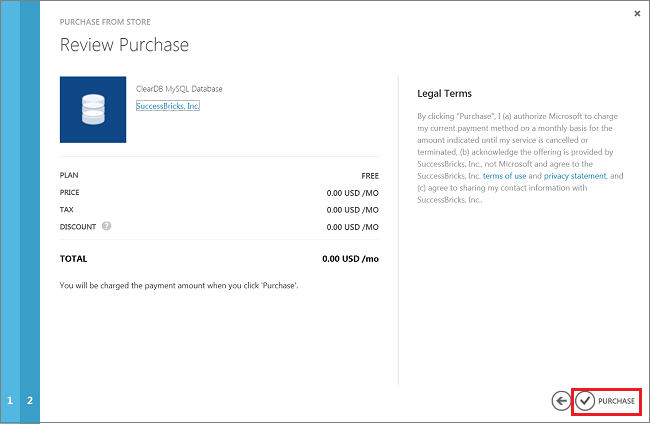

6. Nachdem Sie die Datenbank erstellt wurde, können Sie es auf der Registerkarte **ADD-ONS** im Verwaltungsportal verwalten.

    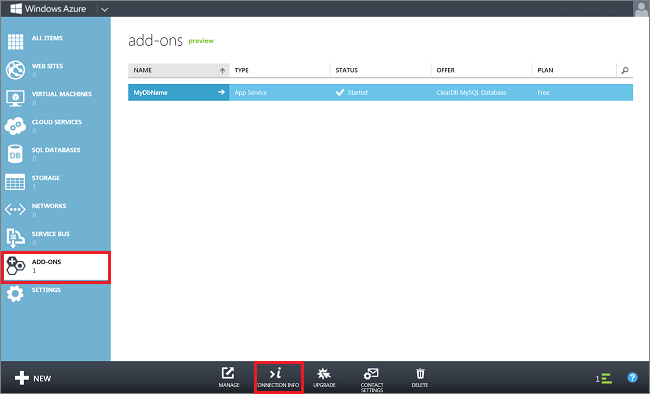

7. Sie können die Datenbankverbindungsinformationen abrufen, indem Sie auf **VERBINDUNGSINFORMATIONEN** am unteren Rand der Seite (siehe oben).

    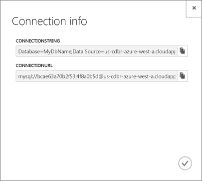 

## So: erstellen eine MySQL-Datenbank als eine verknüpfte Ressource für Azure-Website

Zum Erstellen einer MySQL-Datenbank als eine verknüpfte Ressource, beim Erstellen einer [Website Azure][waws], gehen Sie folgendermaßen vor:

1. Melden Sie sich bei der [Azure-Verwaltungsportal][portal].
2. Klicken Sie auf **+ neue** am unteren Rand der Seite, und wählen Sie dann **zu berechnen**, **WEBSITE**und **Mit der Datenbank erstellen**.

    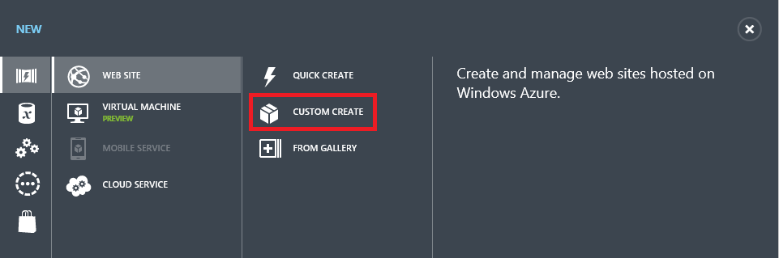

3. Bereitstellen Sie einer **URL** für Ihre Website, wählen Sie die **REGION** für Ihre Website, und wählen Sie aus der Dropdownliste **Datenbank** **Erstellen einer neuen MySQL-Datenbank** aus. Optional können Sie den Standardnamen für die Verbindungszeichenfolge ersetzen. Klicken Sie auf den Pfeil am unteren Rand der Seite.

    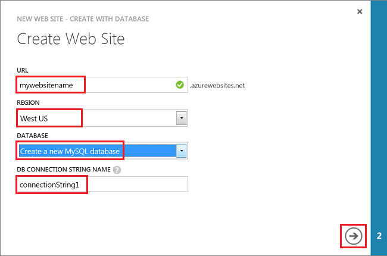 

4. Bereitstellen einer Datenbank **NAME**, wählen Sie die **REGION** für die Datenbank (Dies sollte identisch sein, die Region für Ihre Website), stimmen ClearDBs Vertragsbedingungen, und klicken Sie auf das Häkchen am Fuß des Rahmens.

    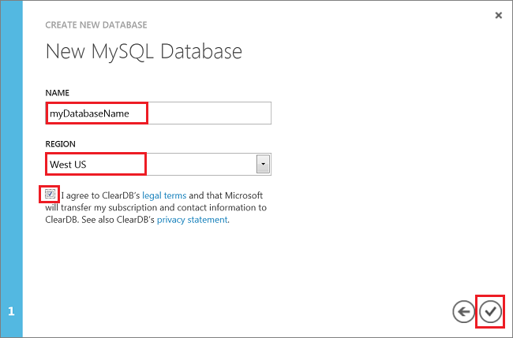

5. Nachdem Sie Ihre Website erstellt wurde, klicken Sie auf den Namen Ihrer Website zu der Website Dashboard zu wechseln.

    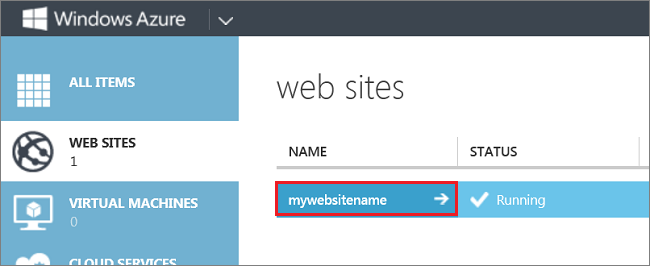

6. Klicken Sie auf **Konfigurieren**.

    

7. Führen Sie einen Bildlauf nach unten bis zum Abschnitt **Verbindungszeichenfolgen** , und klicken Sie auf **Verbindungszeichenfolgen anzeigen**. 

    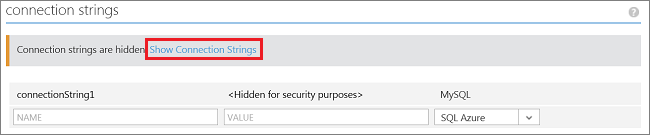

8. Kopieren Sie die Verbindungszeichenfolge für die Verwendung in Ihrer Anwendung.

    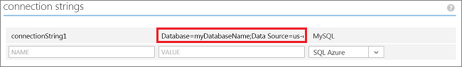

> [AZURE.NOTE] Verbindungszeichenfolgen werden auf Ihrer Website Anwendung von Namen für die Verbindungszeichenfolge zugreifen. In .NET Applications sind Verbindungszeichenfolgen in das Objekt **ConnectionStrings** verfügbar. In einer anderen Programmiersprache werden kann als Umgebungsvariablen zugegriffen Verbindungszeichenfolgen. Weitere Informationen finden Sie unter [Konfigurieren von Websites][configure].

[ClearDB]: http://www.cleardb.com/
[waws]: /documentation/services/web-sites/
[portal]: http://manage.windowsazure.com
[configure]: ../articles/app-service-web/web-sites-configure.md
