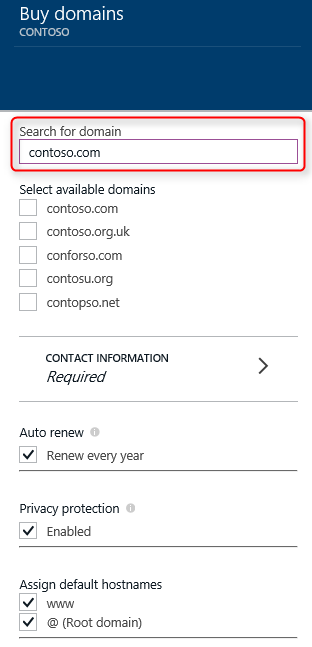

Wenn Sie eine Domäne möchten, können Sie direkt auf [Azure-Verwaltungsportal](https://portal.azure.com) Domänen erwerben. Gehen Sie folgendermaßen vor, um Domänennamen kaufen, und weisen Sie die Web app.

1. Öffnen Sie in Ihrem Browser das [Azure-Verwaltungsportal](https://portal.azure.com)aus.

2. Klicken Sie auf der Registerkarte **Web Apps** auf den Namen der Web app, wählen Sie **Einstellungen**aus, und wählen Sie dann auf **benutzerdefinierte Domänen und SSL**

    

3. Klicken Sie in das **benutzerdefinierte Domänen und SSL** Blade auf **Domänen kaufen**.

    

4. Verwenden Sie in das Blade **Kaufen Domänen** im Textfeld, geben Sie den Namen der Domäne, die, den Sie kaufen möchten. Die vorgeschlagenen verfügbaren Domänen leer-Blasen Weg nur das Textfeld ein. Wählen Sie welche Domäne, die Sie erwerben möchten.

  

5. Klicken Sie auf die **Kontaktinformationen** aus, und füllen Sie die Domäne Kontaktinformationen Formular.

  

6. Klicken Sie auf die **Wählen Sie** auf **Domänen kaufen** Blade und dann die Informationen werden auf Blade **kaufen Bestätigung** angezeigt. Wenn Sie die Vertragsbedingungen annehmen, und klicken Sie auf **Buy**, Ihre Bestellung gesendet wird, und Sie können den Erwerb des **Benachrichtigung**überwachen.

  

  

7. Wenn Sie eine Domäne erfolgreich bestellt, können Sie die Domäne verwalten und Web app zuweisen. Klicken Sie auf der **"..."** auf der rechten Seite Ihrer Domäne. Dann können Sie **Abbrechen erwerben** oder eine **Domäne verwalten**. Klicken Sie auf **Domäne verwalten**, und dann die **Unterdomäne** mit unsere Web app auf **Domäne verwalten** Blade gebunden werden kann.

    

    Nach Abschluss der Konfiguration wird der benutzerdefinierten Domänennamen im Abschnitt **Hostname Bindungen** der Web app aufgeführt sein.

An diesem Punkt sollte es möglich sein, geben den Namen der benutzerdefinierten Domäne in Ihrem Browser, und sehen, dass Sie dieses erfolgreich Web app hat.
