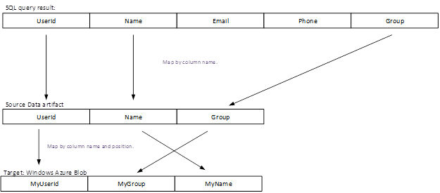

## Spalte Zuordnung mit Translator Regeln
Spalte Zuordnung kann verwendet werden, um anzugeben, wie die Spalten in der "Struktur" Quelle Tabelle Karte auf Spalten in der "Struktur" Empfänger Tabelle angegeben angegeben. Die Eigenschaft **ColumnMapping** steht im Abschnitt **TypeProperties** der Aktivität kopieren.

Spalte Zuordnung unterstützt die folgenden Szenarien:

- Alle Spalten in der Quelltabelle "Struktur" werden alle Spalten in der Tabelle Empfänger "Struktur" zugeordnet.
- Eine Teilmenge der Spalten in der Quelltabelle "Struktur" alle Spalten in der Tabelle Empfänger "Struktur" zugeordnet sind.

Im folgenden werden Fehler Bedingungen und führt zu Fehlern im eine Ausnahme:

- Weniger Spalten oder mehr Spalten in der "Struktur" Empfänger Tabelle als in der Zuordnung festgelegt.
- Doppelte Zuordnung an.
- SQL-Abfrageergebnis verfügt keinen Spaltennamen, der in der Zuordnung angegeben ist.

## Beispiele für Spalte Zuordnung
> [AZURE.NOTE] Die folgenden Beispiele für SQL Azure und Azure Blob sind aber gelten für alle Datenspeicher, die rechteckige Datasets unterstützt. Sie müssen Dataset und verknüpfte Service-Definitionen in den Beispielen unter Anpassen auf Daten in den Quellbereichen relevante Daten verweisen. 

### Beispiel 1 – Zuordnen von SQL Azure zu Azure Blob Spalte
In diesem Beispiel die Eingabewerte Tabelle weist eine Struktur, und es zu einer SQL-Tabelle in einer SQL Azure-Datenbank verweist.

    {
        "name": "AzureSQLInput",
        "properties": {
            "structure": 
             [
               { "name": "userid"},
               { "name": "name"},
               { "name": "group"}
             ],
            "type": "AzureSqlTable",
            "linkedServiceName": "AzureSqlLinkedService",
            "typeProperties": {
                "tableName": "MyTable"
            },
            "availability": {
                "frequency": "Hour",
                "interval": 1
            },
            "external": true,
            "policy": {
                "externalData": {
                    "retryInterval": "00:01:00",
                    "retryTimeout": "00:10:00",
                    "maximumRetry": 3
                }
            }
        }
    }

In diesem Beispiel die Ausgabetabelle weist eine Struktur, und es in ein Blob in einer Azure Blob-Speicher verweist.

    {
        "name": "AzureBlobOutput",
        "properties":
        {
             "structure": 
              [
                    { "name": "myuserid"},
                    { "name": "myname" },
                    { "name": "mygroup"}
              ],
            "type": "AzureBlob",
            "linkedServiceName": "StorageLinkedService",
            "typeProperties": {
                "folderPath": "mycontainer/myfolder",
                "fileName":"myfile.csv",
                "format":
                {
                    "type": "TextFormat",
                    "columnDelimiter": ","
                }
            },
            "availability":
            {
                "frequency": "Hour",
                "interval": 1
            }
        }
    }

Nachfolgend finden Sie die JSON für die Aktivität. Die Spalten aus der Quelle zu Spalten in einem Empfänger (**ColumnMappings**) mithilfe von **Translator** Eigenschaft zugeordnet werden soll.

    {
        "name": "CopyActivity",
        "description": "description", 
        "type": "Copy",
        "inputs":  [ { "name": "AzureSQLInput"  } ],
        "outputs":  [ { "name": "AzureBlobOutput" } ],
        "typeProperties":    {
            "source":
            {
                "type": "SqlSource"
            },
            "sink":
            {
                "type": "BlobSink"
            },
            "translator": 
            {
                "type": "TabularTranslator",
                "ColumnMappings": "UserId: MyUserId, Group: MyGroup, Name: MyName"
            }
        },
       "scheduler": {
              "frequency": "Hour",
              "interval": 1
            }
    }

**Spalte Zuordnung Fluss:**

### Beispiel 2 – Spalte mit SQL-Abfrage aus Azure SQL Azure BLOB-Zuordnung
In diesem Beispiel wird eine SQL-Abfrage verwendet, um Daten aus SQL Azure extrahieren, anstatt einfach den Namen der Tabelle und den Spaltennamen im Abschnitt "Struktur". 

    {
        "name": "CopyActivity",
        "description": "description", 
        "type": "CopyActivity",
        "inputs":  [ { "name": " AzureSQLInput"  } ],
        "outputs":  [ { "name": " AzureBlobOutput" } ],
        "typeProperties":
        {
            "source":
            {
                "type": "SqlSource",
                "SqlReaderQuery": "$$Text.Format('SELECT * FROM MyTable WHERE StartDateTime = \\'{0:yyyyMMdd-HH}\\'', WindowStart)"
            },
            "sink":
            {
                "type": "BlobSink"
            },
            "Translator": 
            {
                "type": "TabularTranslator",
                "ColumnMappings": "UserId: MyUserId, Group: MyGroup,Name: MyName"
            }
        },
        "scheduler": {
              "frequency": "Hour",
              "interval": 1
            }
    }

In diesem Fall werden zuerst die Abfrageergebnisse in der Datenquelle "Struktur" angegebenen Spalten zugeordnet. Als Nächstes werden die Spalten aus der Quelle "Struktur" mit Regeln ColumnMappings angegebenen Spalten in der Empfänger "Struktur" zugeordnet.  Nehmen Sie an, dass die Abfrage 5 Spalten, zwei weitere Spalten dann Werte in die "Struktur" der Quelle zurückgegeben.

**Spalte Zuordnung Fluss**

