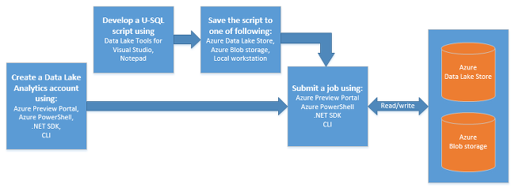

**Die grundlegende Daten dem Analytics-Prozess:**
    

    
1. Erstellen eines Daten dem Analytics-Kontos an.
2. Vorbereiten der Quelldaten an. Daten Lake analytisches Aufträge können Daten aus Azure Lake Datenspeicher Konten oder Azure BLOB-Speicherkonten lesen.   
3. Entwickeln einer U-SQL-Skript an.
4. Senden eines Auftrags (U-SQL-Skript) mit den Daten dem Analytics-Konto an. Der Auftrag aus den Quelldaten liest verarbeiten Sie die Daten zu, wie in der U-SQL-Skript angewiesen, und speichern Sie die Ausgabe entweder ein Konto Lake Datenspeicher oder ein Blob-Speicher-Konto.