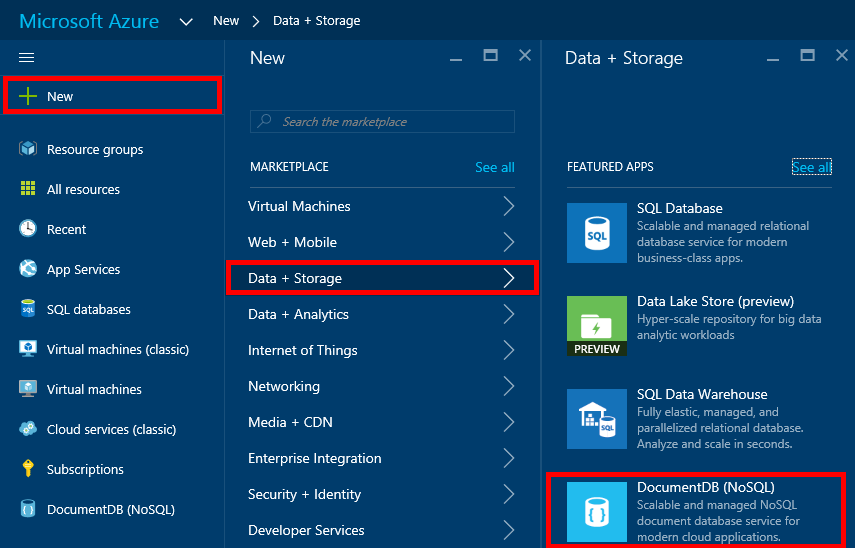

1.  Melden Sie sich mit dem [Azure-Portal](https://portal.azure.com/)aus.
2.  Klicken Sie in der Jumpbar auf **neu**, klicken Sie auf **Daten + Speicher**, und klicken Sie dann auf **DocumentDB (NoSQL)**.

      

3. Geben Sie in das **neue Konto** Blade die gewünschte Konfiguration für das DocumentDB-Konto ein.

    

    - Geben Sie im Feld **ID** einen Namen für das Konto DocumentDB ein.  Wenn die **ID** überprüft wird, wird Sie in das Feld **ID** ein grünes Häkchen angezeigt. Der **ID-** Wert wird der Hostname in der URI. Die **ID** enthalten möglicherweise nur Kleinbuchstaben, Zahlen und die ' – ' Zeichen und muss zwischen 3 und 50 Zeichen. Beachten Sie, dass der Endpunktname, den Sie auswählen, die *documents.azure.com* angefügt ist das Ergebnis, von denen Ihre DocumentDB Konto Endpunkt wird.

    - Wählen Sie im Feld **NoSQL API** **DocumentDB**ein.  

    - Wählen Sie für **Abonnements**das Azure-Abonnement, das Sie für das Konto DocumentDB verwenden möchten. Wenn Ihr Konto nur ein Abonnement enthält, wird dieses Konto standardmäßig aktiviert.

    - **Ressourcengruppe**aktivieren Sie oder erstellen Sie eine Ressourcengruppe für Ihr Konto DocumentDB.  Standardmäßig wird eine neue Ressourcengruppe erstellt. Weitere Informationen finden Sie unter [Verwenden des Azure-Portals zum Verwalten Ihrer Azure Ressourcen](../articles/azure-portal/resource-group-portal.md).

    - Verwenden Sie **Speicherort** , um die geografische Position in der Ihr Konto DocumentDB hosten anzugeben. 

4.  Sobald die neuen DocumentDB Kontooptionen konfiguriert sind, klicken Sie auf **Erstellen**. Aktivieren Sie zum Überprüfen des Status der Bereitstellung den Hub Benachrichtigungen aus.  

      

    

5.  Nachdem das Konto DocumentDB erstellt wurde, ist es für die Verwendung mit Standardeinstellungen bereit. Die Standard-Konsistenz des Kontos DocumentDB wird auf **Sitzung**festgelegt.  Sie können die Standard-Konsistenz anpassen, indem Sie **Standard Konsistenz** im Menü "Ressourcen" auf. Weitere Informationen zum Konsistenz Ebenen von DocumentDB Angeboten finden Sie unter [Konsistenz Ebenen in DocumentDB](../articles/documentdb/documentdb-consistency-levels.md).

      

      

[How to: Create a DocumentDB account]: #Howto
[Next steps]: #NextSteps
[documentdb-manage]:../articles/documentdb/documentdb-manage.md
