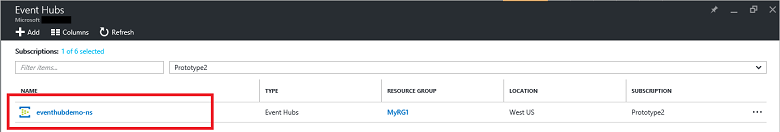

## Erstellen Sie einen Ereignis-Hub

1. Melden Sie sich bei der [Azure-Portal][], und klicken Sie auf **neu** in der oberen linken Ecke des Bildschirms.

2. Klicken Sie auf **Daten + Analytics**, und klicken Sie auf **Ereignis Hubs**.

    

3. Geben Sie in das Blade **Erstellen Namespace** einen Namespacenamen ein. Das System überprüft sofort, um festzustellen, ob der Name verfügbar ist.

    

4. Nachdem Sie den Namespace sichergestellt Name verfügbar ist, und wählen Sie die Preisgestaltung Ebene (Basic oder Standard). Wählen Sie darüber hinaus eine Azure-Abonnement, Ressourcengruppe und Speicherort für die Ressource zu erstellen. 

2. Klicken Sie auf **Erstellen** , um den Namespace zu erstellen.

6. Klicken Sie in der Liste Ereignis Hubs Namespace auf den neu erstellten Namespace.      

    

7. Klicken Sie in das Blade Namespace auf **Ereignis Hubs**.

    

8. Klicken Sie am oberen Rand der Blade auf **Ereignis Hub hinzufügen**.

    

3. Geben Sie einen Namen für Ihre Veranstaltung Hub, und klicken Sie auf **Erstellen**.

    

4. Klicken Sie in der Liste der Hubs Ereignis auf den Namen der neu erstellten Ereignis Hub. 

    

5. Zurück in das Namespace Blade (nicht das bestimmte Ereignis Hub Blade) klicken Sie auf **freigegebene Access-Richtlinien**, und klicken Sie dann auf **RootManageSharedAccessKey**.

    

5. Klicken Sie auf die Schaltfläche Kopieren, um die Verbindungszeichenfolge **RootManageSharedAccessKey** in die Zwischenablage zu kopieren. Speichern Sie diese Verbindungszeichenfolge später im Lernprogramm verwendet.

    

Der Hub Ereignis ist nun erstellt, und Sie haben die Verbindungszeichenfolgen, die Sie senden und Empfangen von Ereignissen müssen.

[Azure-portal]: https://portal.azure.com/