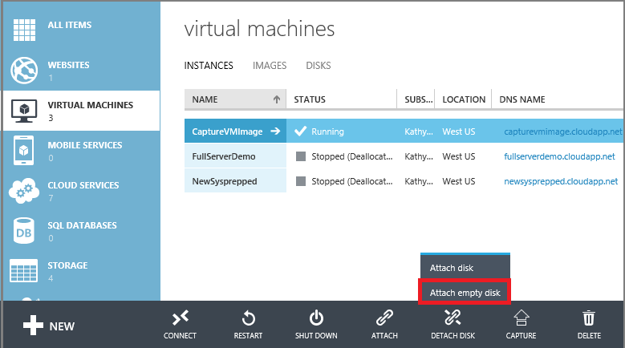
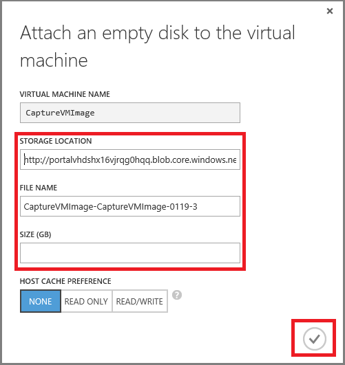
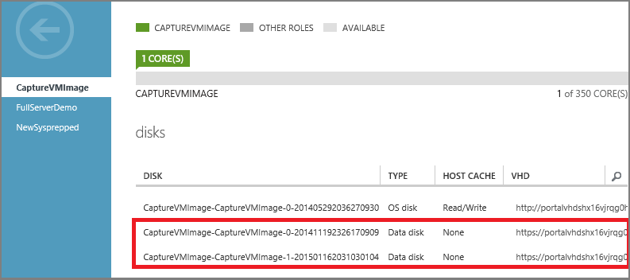
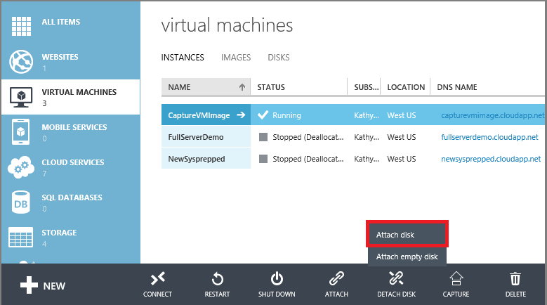
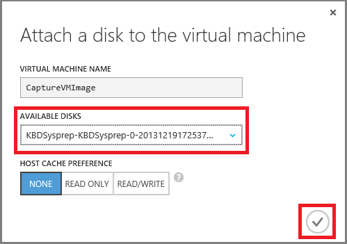
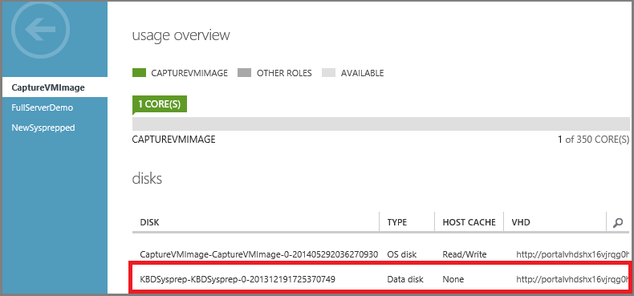

## Fügen Sie einen leeren Datenträger

Anfügen eines leeren Datenträgers ist eine einfache Möglichkeit, einen Datenträger, hinzugefügt werden, da Azure VHD-Datei für Sie erstellt und in das Konto Storage gespeichert.

1. Klicken Sie auf **virtuellen Computern**, und wählen Sie dann auf den entsprechenden virtuellen Computer.

2. Klicken Sie auf der Befehlsleiste in klicken Sie auf **Einfügen**und dann auf **Leeren Datenträger anfügen**.

    

3.  Das Dialogfeld **Fügen Sie einen leeren Datenträger** angezeigt wird.

    

    Gehen Sie wie folgt vor:

    - Übernehmen Sie im Feld **Dateiname**den Standardnamen, oder geben Sie einem anderen Platzhalter für die VHD-Datei. Der Datenträger Daten verwendet einen automatisch generierten Name, selbst wenn Sie einen anderen Namen für die VHD-Datei eingeben.

    - Geben Sie die **Größe (GB)** des Datenträgers Daten ein.

    - Klicken Sie auf das Häkchen auf Fertig stellen.

4.  Nachdem der Daten Datenträger erstellt und verbunden ist, wird es im Dashboard von den virtuellen Computer aufgeführt.

    

> [AZURE.NOTE] Nachdem Sie einen neuen Datenträger hinzufügen möchten, müssen Sie den virtuellen Computer anmelden und Initialisierung des Datenträgers, damit sie verwendet werden kann. 

## So: Fügen Sie einen vorhandenen Datenträger

Anfügen eines vorhandenen Datenträgers erfordert, dass Sie eine VHD verfügbar in einem Speicherkonto verfügen. Verwenden Sie das [Hinzufügen AzureVhd](https://msdn.microsoft.com/library/azure/dn495173.aspx) Cmdlet VHD-Datei mit dem Speicherkonto hochladen aus. Nachdem Sie erstellt und die VHD-Datei hochgeladen haben, können Sie es an einen virtuellen anfügen.

1. Klicken Sie auf **virtuellen Computern**, und wählen Sie dann auf den entsprechenden virtuellen Computer.

2. Klicken Sie auf **Einfügen**, und wählen Sie dann auf **Anfügen Datenträger**, auf der Befehlsleiste.

    

3. Wählen Sie den Datenträger Daten, und klicken Sie dann auf das Häkchen, um den Datenträger Daten anzufügen.

    

4.  Nachdem der Datenträger Daten verbunden ist, wird es im Dashboard von den virtuellen Computer aufgeführt.

    
