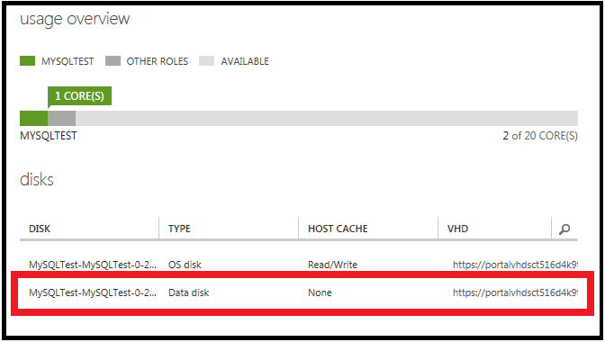
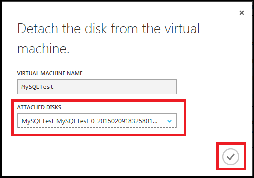

<properties writer="kathydav" editor="tysonn" manager="timlt" />

Wenn Sie einen Datenträger, der mit einem virtuellen Computer angeschlossen ist nicht mehr benötigen, können Sie ganz einfach trennen. Dies entfernt den Datenträger aus des virtuellen Computers, aber keine aus dem Speicher entfernt. 

Wenn Sie die vorhandenen Daten auf dem Datenträger erneut verwenden möchten, können Sie desselben virtuellen Computers oder einem anderen Platzhalter erneut an.  

> [AZURE.NOTE] Betriebssystem-Laufwerk trennen, Sie zuerst des virtuellen Computers zu löschen müssen.

## Suchen nach der Datenträger

Gehen Sie folgendermaßen vor, wenn Sie nicht, den Namen des Datenträgers wissen oder möchten sie überprüfen, bevor Sie getrennt.

1. Melden Sie sich zum [Azure klassischen Portal](http://manage.windowsazure.com)aus.

2. Klicken Sie auf **virtuellen Computern**, klicken Sie auf den Namen des virtuellen Computers, und klicken Sie dann auf **Dashboard**.

3. Unter **Datenträger**in der Tabelle den Namen und Typ aller angefügten Festplatten aufgeführt. Dieser Bildschirm zeigt beispielsweise einen virtuellen Computer mit einem Betriebssystem (BS) und eine Daten:

    

## Trennen Sie den Datenträger

1. Klicken Sie auf **virtuellen Computern**, klicken Sie auf den Namen des virtuellen Computers, die den Datenträger Daten enthält, die, den Sie trennen möchten, und klicken Sie dann auf **Dashboard**.

2. Klicken Sie auf der Befehlsleiste **Datenträger trennen**.

3. Wählen Sie den Datenträger Daten, und klicken Sie dann auf das Häkchen, um es zu trennen.

    

Der Datenträger verbleibt im Speicher, jedoch nicht mehr an einem virtuellen Computer angefügt wird.
