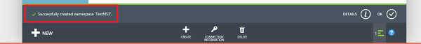
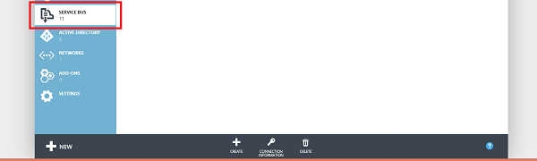
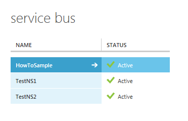

## Was sind Servicebuswarteschlangen?

Servicebuswarteschlangen unterstützt ein **vermittelten messaging** Communication Modell. Bei der Verwendung von Warteschlangen kommunizieren Komponenten einer verteilten Anwendung nicht direkt miteinander; Stattdessen exchange sie Nachrichten über eine Warteschlange, die als Zwischenstation (Bank) fungiert. Eine Nachricht Producer (Absender) übergibt eine Nachricht in der Warteschlange und deren fortgesetzt. Asynchrone Nachricht Consumer (Empfänger) die Nachricht aus der Warteschlange abruft und diesen verarbeitet. Der Hersteller hat keine Antwort vom Consumer warten, um weiterhin verarbeiten und weiteren Nachrichten senden. Warteschlangen bieten **First In, das erste Out (FIFO)** Nachrichtenübermittlung an einen oder mehrere verschiedenen Consumer. Das heißt, Nachrichten in der Regel empfangen und verarbeitet werden von den Empfängern in der Reihenfolge, in der er hinzugefügt wurden, in der Warteschlange und jede Nachricht empfangen und nur eine Nachricht Consumer verarbeiteten ist.

Servicebuswarteschlangen sind eine allgemeine Technologie, die für eine Vielzahl von Szenarien verwendet werden kann:

-   Kommunikation zwischen Web- und Worker Rollen in einem mit mehreren Ebenen Azure-Anwendung.
-   Kommunikation zwischen lokalen apps und Azure gehostete apps in einer Hybrid-Lösung.
-   Kommunikation zwischen Komponenten einer verteilten Anwendung lokal in anderen Organisationen oder Abteilungen einer Organisation ausgeführt.

Verwenden von Warteschlangen, können Sie Ihre Programme einfacher skalieren, und aktivieren Weitere Stabilität bei Ihrer Architektur.

## Erstellen Sie einen Namespace service

Um mit Servicebuswarteschlangen in Azure zu beginnen, müssen Sie zuerst einen Dienstnamespace erstellen. Ein Namespace stellt einen Bereiche Container zum Adressieren Dienstbus Ressourcen innerhalb Ihrer Anwendung bereit.

So erstellen Sie einen namespace

1.  Melden Sie sich bei der [Azure klassischen Portal][].

2.  Klicken Sie im linken Navigationsbereich des Portals **Dienstbus**auf.

3.  Klicken Sie im unteren Bereich des Portals auf **Erstellen**.
    

4.  Geben Sie im Dialogfeld **Hinzufügen eines neuen Namespace** einen Namespacenamen ein. Das System überprüft sofort, um festzustellen, ob der Name verfügbar ist.   
    

5.  Nach dem Namen des Namespaces sicherzustellen verfügbar ist, wählen Sie das Land oder Region, in dem Ihre Namespace gehostet werden soll (Stellen Sie sicher, dass Sie die gleiche Land/Region in dem Sie Ihre Ressourcen berechnen bereitstellen verwenden).

     > [AZURE.IMPORTANT] Wählen Sie die **gleichen Region** , die Sie für die Bereitstellung Ihrer Anwendungs auswählen möchten. Dadurch erhalten Sie die optimale Leistung.

6.  Lassen Sie die anderen Felder im Dialogfeld mit ihren Standardwerten (**Messaging** und **Standard Ebene**), und klicken Sie auf das Häkchen OK. Das System jetzt Ihren Namespace erstellt und es ermöglicht. Sie müssen möglicherweise warten Sie einige Minuten als die Vorschriften Systemressourcen für Ihr Konto.

    

Der Namespace, die Sie erstellt hat einen Moment, bis Sie aktivieren möchten, und dann im Portal angezeigt wird. Warten Sie, bis der Status des Namespace **aktiv** , bevor Sie fortfahren ist.

## Stellen Sie die Standardeinstellung Management Anmeldeinformationen für den namespace

Um Management Vorgänge ausführen, beispielsweise eine Warteschlange erstellen, klicken Sie auf den neuen Namespace, müssen Sie die Verwaltung Anmeldeinformationen für den Namespace beziehen. Sie können diese Anmeldeinformationen vom [Azure klassischen Portal][]abrufen.

###Zum Abrufen von Anmeldeinformationen Management aus dem portal

1.  Klicken Sie im linken Navigationsbereich auf den Knoten **Dienstbus** , um die Liste der verfügbaren Namespaces anzuzeigen:   
    

2.  Wählen Sie den Namespace des soeben erstellten in der angezeigten Liste aus:   
    

3.  Klicken Sie auf die **Verbindungsinformationen**.   
    

4.  Klicken Sie im **Access-Verbindungsinformationen** finden Sie die Verbindungszeichenfolge, die den SAS-Taste und den wichtigsten Namen enthält.   

    
    
5.  Notieren Sie die-Taste, oder kopieren Sie es in die Zwischenablage zu.

  [Azure klassischen-portal]: http://manage.windowsazure.com

