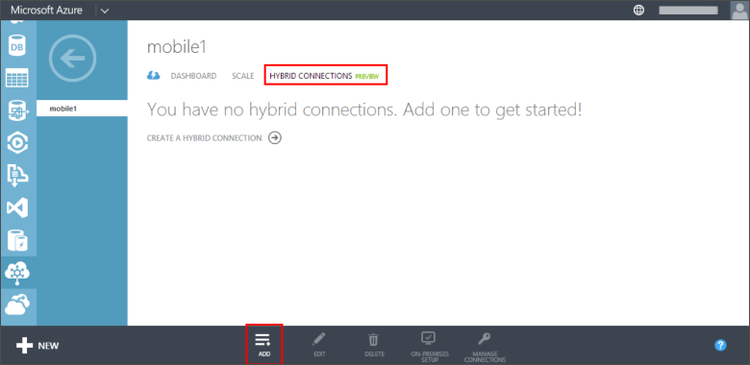

1. Melden Sie sich auf dem lokalen Computer an der [Azure-Verwaltungsportal](http://manager.windowsazure.com) (Dies ist das alte Portal) an.

2. Wählen Sie am unteren Rand des Navigationsbereichs, **+ neu** > **App Services** > **BizTalk-Dienst** > **Benutzerdefinierte erstellen**.

3. Geben Sie einen **Namen der BizTalk-Dienst** , und wählen Sie eine **Edition**. 

    In diesem Lernprogramm verwendet **mobile1**. Sie müssen einen eindeutigen Namen für Ihre neue BizTalk Service angeben.

4. Nachdem der BizTalk Service erstellt wurde, wählen Sie die Registerkarte **Hybrid Verbindungen** aus, und klicken Sie dann klicken Sie auf **Hinzufügen**.

    

    Dadurch wird eine neue Hybrid Verbindung erstellt.

5. **Host Name** einen **Namen** und eine für die Verbindung Hybrid bereitstellen, und legen Sie **Port** auf `1433`. 
  
    

    Der Hostname ist der Name des lokalen Servers. Dadurch wird die Hybrid-Verbindung zum Zugreifen auf SQL Server Port 1433 konfiguriert. Wenn Sie eine benannte Instanz von SQL Server verwenden, verwenden Sie stattdessen statischen Ports, die Sie zuvor definiert.

6. Nachdem Sie die neue Verbindung erstellt haben, wird den Status der der neue Verbindung zeigt **lokale setup unvollständig**.

7. Navigieren Sie zurück zu Ihrem mobilen Dienst, klicken Sie auf **Konfigurieren**, führen Sie einen Bildlauf nach unten bis zum **Hybrid Verbindungen** klicken Sie auf **Add Hybrid Verbindung**, dann wählen Sie die soeben erstellte Verbindung Hybrid und klicken Sie auf **OK**.

    Dies ermöglicht Ihren mobilen Dienst für Ihre neue Hybrid-Verbindung zu verwenden.

Als Nächstes müssen Sie den Hybrid-Verbindungs-Manager auf dem lokalen Computer installieren.