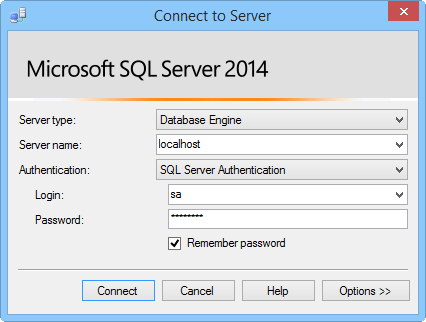

In diesem Abschnitt wird gezeigt, wie Sie eine SQL Server Express nicht installieren, TCP/IP aktivieren, legen Sie einen statischen Port und erstellen Sie eine Datenbank, die mit Hybrid Verbindungen verwendet werden kann.  

###SQL Server Express installieren

Um einer lokalen SQL Server- oder SQL Server Express-Datenbank mit einem Hybriden Verbindung verwenden zu können, muss TCP/IP auf einen statischen Port aktiviert sein. Standardinstanzen auf SQL Server verwenden statischen Port 1433, benannte Instanzen nicht. Aus diesem Grund werden wir die Standardinstanz installieren. Wenn Sie bereits über die standardmäßige Instanz von SQL Server Express installiert haben, können Sie diesen Abschnitt überspringen.

1. Führen Sie die **SQLEXPRWT_x64_ENU.exe** oder **SQLEXPR_x86_ENU.exe** -Datei, die Sie heruntergeladen haben, um SQL Server Express zu installieren. Der SQL Server-Installation Center-Assistent wird angezeigt.
    
2. Wählen Sie **eigenständige neue SQL Server-Installation oder Hinzufügen von Features zu einer vorhandenen Installation**, folgen Sie den Anweisungen, die Einstellungen, und Standardoptionen akzeptieren, bis Sie **Instanzkonfiguration** zu gelangen.
    
3. Klicken Sie auf der Seite **Instanzkonfiguration** **Standardinstanz**, wählen Sie dann auf der Seite **Server-Konfiguration** die Standardeinstellungen zu übernehmen.

    >[AZURE.NOTE]Wenn Sie bereits eine Standardinstanz von SQL Server installiert haben, können Sie mit dem nächsten Abschnitt überspringen und diese Instanz Hybrid-Verbindungen verwenden. 
    
5. Wählen Sie auf der Seite **Konfiguration der Datenbank-Engine** unter **Authentifizierungsmodus** **Gemischten Modus (SQL Server- und Windows-Authentifizierung aus)**, und geben Sie ein sicheres Kennwort für das integrierte **sa** Administratorkonto.
    
    In diesem Lernprogramm verwenden Sie SQL Server-Authentifizierung. Achten Sie darauf, dass Sie das Kennwort ein, das Sie bereitstellen möchten, denken Sie daran, da Sie diesen später benötigen.
    
6. Beenden Sie den Assistenten, um die Installation durchzuführen.

###Aktivieren von TCP/IP und einen statischen Port festlegen

In diesem Abschnitt verwendet SQL Server Konfigurations-Manager, die bei der Installation von SQL Server Express, aktivieren TCP/IP, und legen Sie eine statische IP-Adresse installiert wurde. 

1. Folgen Sie den Schritten [Aktivieren TCP/IP Network Protocol für SQL Server](http://technet.microsoft.com/library/hh231672%28v=sql.110%29.aspx) TCP/IP Zugriff auf die Instanz zu aktivieren.

2. (Optional) Wenn Sie nicht die Standardinstanz verwenden können, müssen Sie in [Server zu Listen, die über einen bestimmten TCP-Anschluss konfigurieren](https://msdn.microsoft.com/library/ms177440.aspx) , einen statischen Port für die Instanz einzurichten Schritte. Wenn Sie diesen Schritt abgeschlossen haben, verbinden Sie den neuen Port, den Sie zu definieren, statt Port 1433 verwenden.

3. (Optional) Fügen Sie bei Bedarf Ausnahmen in der Firewall dürfen Remotezugriff auf SQL Server-Prozess (sqlservr.exe).

###Erstellen einer neuen Datenbank in der lokalen SQL Server-Instanz

1. Schließen Sie in SQL Server Management Studio an der SQL Server, die Sie gerade installiert. (Wenn **mit Server verbinden** Dialogfeld erscheint nicht automatisch, im linken Bereich auf **Objekt-Explorer** navigieren, klicken Sie auf **Verbinden**, und klicken Sie dann auf **Datenbank-Engine**.)     

    
    
    Wählen Sie für den **Typ der Server** **-Datenbank-Engine**aus. **Servernamen**können Sie **Localhost** oder den Namen des Computers, auf dem Sie SQL Server installiert haben. Wählen Sie **SQL Server-Authentifizierung**aus, und geben Sie das Kennwort für den Benutzernamen sa, den Sie zuvor erstellt haben. 
    
2. Klicken Sie zum Erstellen einer neuen Datenbank mithilfe von SQL Server Management Studio mit der rechten Maustaste **Datenbanken** im Objekt-Explorer, und klicken Sie dann auf **Neue Datenbank**.
    
3. Geben Sie im Dialogfeld **Neue Datenbank** `OnPremisesDB`, und klicken Sie dann auf **OK**. 
    
4. Im Objekt-Explorer Wenn Sie **Datenbanken**, erweitern Sie sehen Sie, dass die neue Datenbank erstellt wird.

###Erstellen eines neuen SQL Server-Benutzernamens und das Festlegen von Berechtigungen

Schließlich erstellen Sie eine neue SQL Server-Anmeldung mit eingeschränkten Berechtigungen. Ihre Azure Service verbindet mit SQL Server lokal mit dieser Anmeldung anstelle der integrierten sa Login, die Vollzugriff auf dem Server verfügt.

1. In SQL Server Management Studio Objekt-Explorer mit der rechten Maustaste in der Datenbank **OnPremisesDB** , und klicken Sie auf **Neue Abfrage**.

2.  Fügen Sie die folgende TSQL-Abfrage in das Abfragefenster ein.

        USE [master]
        GO
        
        /* Replace the PASSWORD in the following statement with a secure password. 
           If you save this script, make sure that you secure the file to 
           securely maintain the password. */ 
        CREATE LOGIN [HybridConnectionLogin] WITH PASSWORD=N'<**secure_password**>', 
            DEFAULT_DATABASE=[OnPremisesDB], DEFAULT_LANGUAGE=[us_english], 
            CHECK_EXPIRATION=OFF, CHECK_POLICY=ON
        GO
    
        USE [OnPremisesDB]
        GO
    
        CREATE USER [HybridConnectionLogin] FOR LOGIN [HybridConnectionLogin] 
        WITH DEFAULT_SCHEMA=[dbo]
        GO

        GRANT CONNECT TO [HybridConnectionLogin]
        GRANT CREATE TABLE TO [HybridConnectionLogin]
        GRANT CREATE SCHEMA TO [HybridConnectionLogin]
        GO  
   
3. Ersetzen Sie im obigen Skript die Zeichenfolge `<**secure_password**>` mit ein sicheres Kennwort für die neue *HybridConnectionsLogin*.

4. **Ausführen** der Abfrage zum Erstellen neuen Benutzername und erteilen die erforderlichen Berechtigungen in der lokalen Datenbank.

