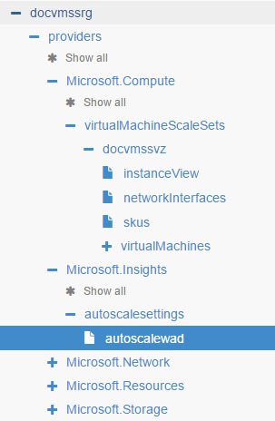
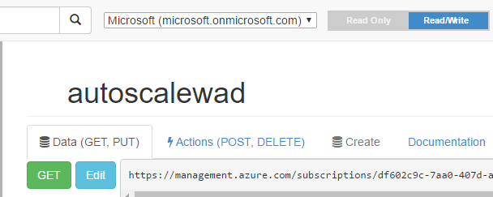

# <a name="advanced-autoscale-configuration-using-resource-manager-templates-for-vm-scale-sets"></a>Erweiterte automatisch skalieren Konfiguration Ressourcenmanager Vorlagen für virtuellen Computer Maßstab Mengen verwenden

Sie können sich und virtuellen Computern skalieren gebildeten ausgehend von Leistung metrischen Schwellenwerte für Listen, indem Sie einen periodischen Zeitplan oder eines bestimmten Datums zurück skalieren. Sie können auch e-Mails und Webhook Benachrichtigungen für Maßstab Aktionen konfigurieren. Diese exemplarische Vorgehensweise zeigt ein Beispiel für alle der oben genannten mithilfe einer Ressourcenmanager Vorlage auf virtuellen Computer Skalierung festlegen konfigurieren.

>[AZURE.NOTE] Während Sie die Schritte für die Skalierung Mengen virtueller Computer es wird erläutert, können Sie die gleiche für automatische Skalierung Cloud Services und Web Apps anwenden.
Eine einfache Skala ein-/Einstellung auf einer virtuellen Computer Skalierung festlegen basierend auf einer einfachen Leistungsmetrik wie CPU finden Sie in der [Linux](../articles/virtual-machine-scale-sets/virtual-machine-scale-sets-linux-autoscale.md) und [Windows](../articles/virtual-machine-scale-sets/virtual-machine-scale-sets-windows-autoscale.md) -Dokumenten


## <a name="walkthrough"></a>Exemplarische Vorgehensweise
In dieser Anleitung erfahren verwenden wir [Azure Ressource Explorer](https://resources.azure.com/) konfigurieren und aktualisieren Sie diese Einstellung automatisch skalieren für eine Reihe von Farben-Skala aus. Azure Ressource Explorer ist eine einfache Möglichkeit zum Verwalten von Azure Ressourcen per Ressourcenmanager Vorlagen. Wenn Sie neu bei Azure Ressource Explorer-Tools sind, lesen Sie [Diese Einführung](https://azure.microsoft.com/blog/azure-resource-explorer-a-new-tool-to-discover-the-azure-api/).

1. Bereitstellen einer neuen Skala mit einer Einstellung grundlegende automatisch skalieren festlegen. In diesem Artikel wird das entsprechende Element aus eine Windows weist Azure-Katalog Schnellstart verwendet Skala mit einer Vorlage grundlegende automatisch skalieren festlegen. Linux Maßstab Sätze funktionieren genauso.

2. Nach der Skalierung festlegen wird erstellt, und navigieren Sie zu skalieren festlegen Ressource aus Azure Ressource Explorer. Sie finden Sie hier unter Microsoft.Insights Knoten.

    

    Die Vorlage Ausführung hat eine automatisch skalieren Standardeinstellung mit dem Namen **'Autoscalewad'**erstellt. Klicken Sie auf der rechten Seite können Sie die vollständige Definition der diese Einstellung automatisch skalieren anzeigen. In diesem Fall enthält die Standardeinstellung für automatisch skalieren mit einer CPU % basierend Skalierung und Maßstab in die Regel ein.

3. Sie können nun weitere Profile und Regeln basierend auf dem Zeitplan oder bestimmte Anforderungen hinzufügen. Erstellen wir eine Einstellung automatisch skalieren mit drei Profile ein. Überprüfen Sie Profile und Regeln in automatisch skalieren Grundlegendes zum [Skalieren bewährte Methoden](../articles/monitoring-and-diagnostics/insights-autoscale-best-practices.md)aus. 

    | Profile und Regeln | Beschreibung |
    |---------|-------------------------------------|
    | **Profil** | **Leistung/Metrisch basiert**    |
    | Regel    | Anzahl der Service Bus Warteschlange Nachrichten > x |
    | Regel    | Anzahl der Service Bus Warteschlange Nachrichten < y |
    | Regel    | CPU% > n                            |
    | Regel    | CPU% < p                            |
    | **Profil** | **Weekday Uhr (keine Regeln)**    |
    | **Profil** | **Produkt-Launch-Tag (keine Regeln)**       |

4. Hier ist ein hypothetisches Anpassungsbereich für Szenario, das wir für diese exemplarische Vorgehensweise zu verwenden:
    - _**Laden der Grundlage** - ich möchte heraus oder in skalieren basierend auf die Belastung meine Anwendung gehostet wird, klicken Sie auf Meine Maßstab festlegen._
    - _**Größe der Nachrichtenwarteschlange** - ich mithilfe von einem Dienst Bus Warteschlange für eingehenden Nachrichten meiner Anwendung. Verwenden Sie die Anzahl der Nachrichten und die Warteschlange CPU%, und konfigurieren ein Standardprofils, damit eine Aktion Maßstab ausgelöst wird, wenn eine Nachricht zählen oder CPU-Treffer den Schwellenwert._
    - _**Zeitpunkt der Woche und Tag** - ich möchte eine wöchentliche periodischen 'Zeit des Tages' Basis Profil mit der Bezeichnung 'Weekday morgen Stunden'. Auf der Grundlage der zurückliegenden Daten weiß ich, dass es verbessern können, um eine bestimmte Anzahl von virtuellen Computer Instanzen der Anwendung Laden dieses Zeitraums verarbeitet wird._
    - _**Besondere Daten** - ich ein Profil "Produkt starten Day" hinzugefügt. Ich Planung vorausschauende für bestimmte Datumsangaben, damit meine Anwendung verarbeitet die laden Fälligkeitsdatum marketing Ankündigungen und wenn wir ein neues Produkt in der Anwendung setzen bereit ist._
    - _Die letzten beiden Profile können auch andere metrischen je Leistungsregeln darin enthaltenen haben. In diesem Fall ich möchte keinen eine haben und stattdessen um auf die standardmäßigen Leistungsmetrik aufsetzen basierenden Regeln. Regeln sind für die periodische und Datum-basierten Profile optional._

    Automatisch skalieren-Engine Prioritäten der Profile und Regeln werden auch im Artikel [bewährte Methoden für die automatische Skalierung](../articles/monitoring-and-diagnostics/insights-autoscale-best-practices.md) erfasst.
    Eine Liste der allgemeinen Kennzahlen zur automatisch skalieren finden Sie unter [Allgemeine Kennzahlen zur automatisch skalieren](../articles/monitoring-and-diagnostics/insights-autoscale-common-metrics.md)

5. Stellen Sie sicher, dass Sie sich in den **Schreibgeschützten** Modus in Ressource Explorer befinden

    

6. Klicken Sie auf Bearbeiten. **Ersetzen Sie** das Element 'Profile' automatisch skalieren-Einstellung mit den folgenden aus:

    

    ```
    {
            "name": "Perf_Based_Scale",
            "capacity": {
              "minimum": "2",
              "maximum": "12",
              "default": "2"
            },
            "rules": [
              {
                "metricTrigger": {
                  "metricName": "MessageCount",
                  "metricNamespace": "",
                  "metricResourceUri": "/subscriptions/s1/resourceGroups/rg1/providers/Microsoft.ServiceBus/namespaces/mySB/queues/myqueue",
                  "timeGrain": "PT5M",
                  "statistic": "Average",
                  "timeWindow": "PT5M",
                  "timeAggregation": "Average",
                  "operator": "GreaterThan",
                  "threshold": 10
                },
                "scaleAction": {
                  "direction": "Increase",
                  "type": "ChangeCount",
                  "value": "1",
                  "cooldown": "PT5M"
                }
              },
              {
                "metricTrigger": {
                  "metricName": "MessageCount",
                  "metricNamespace": "",
                  "metricResourceUri": "/subscriptions/s1/resourceGroups/rg1/providers/Microsoft.ServiceBus/namespaces/mySB/queues/myqueue",
                  "timeGrain": "PT5M",
                  "statistic": "Average",
                  "timeWindow": "PT5M",
                  "timeAggregation": "Average",
                  "operator": "LessThan",
                  "threshold": 3
                },
                "scaleAction": {
                  "direction": "Decrease",
                  "type": "ChangeCount",
                  "value": "1",
                  "cooldown": "PT5M"
                }
              },
              {
                "metricTrigger": {
                  "metricName": "\\Processor(_Total)\\% Processor Time",
                  "metricNamespace": "",
                  "metricResourceUri": "/subscriptions/s1/resourceGroups/rg1/providers/Microsoft.Compute/virtualMachineScaleSets/<this_vmss_name>",
                  "timeGrain": "PT5M",
                  "statistic": "Average",
                  "timeWindow": "PT30M",
                  "timeAggregation": "Average",
                  "operator": "GreaterThan",
                  "threshold": 85
                },
                "scaleAction": {
                  "direction": "Increase",
                  "type": "ChangeCount",
                  "value": "1",
                  "cooldown": "PT5M"
                }
              },
              {
                "metricTrigger": {
                  "metricName": "\\Processor(_Total)\\% Processor Time",
                  "metricNamespace": "",
                  "metricResourceUri": "/subscriptions/s1/resourceGroups/rg1/providers/Microsoft.Compute/virtualMachineScaleSets/<this_vmss_name>",
                  "timeGrain": "PT5M",
                  "statistic": "Average",
                  "timeWindow": "PT30M",
                  "timeAggregation": "Average",
                  "operator": "LessThan",
                  "threshold": 60
                },
                "scaleAction": {
                  "direction": "Decrease",
                  "type": "ChangeCount",
                  "value": "1",
                  "cooldown": "PT5M"
                }
              }
            ]
          },
          {
            "name": "Weekday_Morning_Hours_Scale",
            "capacity": {
              "minimum": "4",
              "maximum": "12",
              "default": "4"
            },
            "rules": [],
            "recurrence": {
              "frequency": "Week",
              "schedule": {
                "timeZone": "Pacific Standard Time",
                "days": [
                  "Monday",
                  "Tuesday",
                  "Wednesday",
                  "Thursday",
                  "Friday"
                ],
                "hours": [
                  6
                ],
                "minutes": [
                  0
                ]
              }
            }
          },
          {
            "name": "Product_Launch_Day",
            "capacity": {
              "minimum": "6",
              "maximum": "20",
              "default": "6"
            },
            "rules": [],
            "fixedDate": {
              "timeZone": "Pacific Standard Time",
              "start": "2016-06-20T00:06:00Z",
              "end": "2016-06-21T23:59:00Z"
            }
          }
    ```
    Unterstützte Felder und deren Werte finden Sie unter [Skalieren REST-API-Dokumentation](https://msdn.microsoft.com/en-us/library/azure/dn931928.aspx).

    Ihre Einstellung automatisch skalieren enthält jetzt die drei Profile weiter oben erläutert.

7.  Schließlich wollen Abschnitt **Benachrichtigung** automatisch skalieren. Automatisch skalieren Benachrichtigungen ermöglichen es Ihnen, führen Sie drei Möglichkeiten, wenn eine Skalierung oder in Aktion erfolgreich ausgelöst.

    1. Informieren Sie den Administrator und co-Administratoren Ihres Abonnements

    2. Per e-Mail eine Reihe von Benutzern

    3. Auslösen eines Anrufs Webhook an. Wenn er ausgelöst wird, sendet diese Webhook Metadaten für die automatische Skalierung Bedingung Ressource keine Skalierung festlegen. Weitere Informationen zu den Nutzdaten der automatisch skalieren Webhook finden Sie unter [Konfigurieren von Webhook und e-Mail-Benachrichtigungen für automatisch skalieren](../articles/monitoring-and-diagnostics/insights-autoscale-to-webhook-email.md).

    Fügen Sie den folgenden zur Einstellung automatisch skalieren ersetzen Sie dabei Ihre **Benachrichtigung** Element, dessen Wert null ist.

    ```
    "notifications": [
          {
            "operation": "Scale",
            "email": {
              "sendToSubscriptionAdministrator": true,
              "sendToSubscriptionCoAdministrators": false,
              "customEmails": [
                  "user1@mycompany.com",
                  "user2@mycompany.com"
                  ]
            },
            "webhooks": [
              {
                "serviceUri": "https://foo.webhook.example.com?token=abcd1234",
                "properties": {
                  "optional_key1": "optional_value1",
                  "optional_key2": "optional_value2"
                }
              }
            ]
          }
        ]

    ```

    Drücken Sie die Schaltfläche **setzen** Ressourcen-Explorer, um die Einstellung automatisch skalieren aktualisieren.

Sie haben eine Einstellung automatisch skalieren auf einer virtuellen Computer Skala eingeschlossen werden sollen mehrere Maßstab Profile und skalieren Benachrichtigungen festlegen aktualisiert.

## <a name="next-steps"></a>Nächste Schritte

Verwenden Sie diese Links erfahren Sie mehr über automatische Skalierung aus.

[Allgemeine Kennzahlen zur automatisch skalieren](../articles/monitoring-and-diagnostics/insights-autoscale-common-metrics.md)

[Bewährte Methoden für Azure automatisch skalieren](../articles/monitoring-and-diagnostics/insights-autoscale-best-practices.md)

[Verwalten von automatisch Skalieren mithilfe der PowerShell](../articles/monitoring-and-diagnostics/insights-powershell-samples.md#create-and-manage-autoscale-settings)

[Verwalten Sie automatisch skalieren mit CLI](../articles/monitoring-and-diagnostics/insights-cli-samples.md#autoscale)

[Konfigurieren von Webhook und e-Mail-Benachrichtigungen für automatisch skalieren](../articles/monitoring-and-diagnostics/insights-autoscale-to-webhook-email.md)
