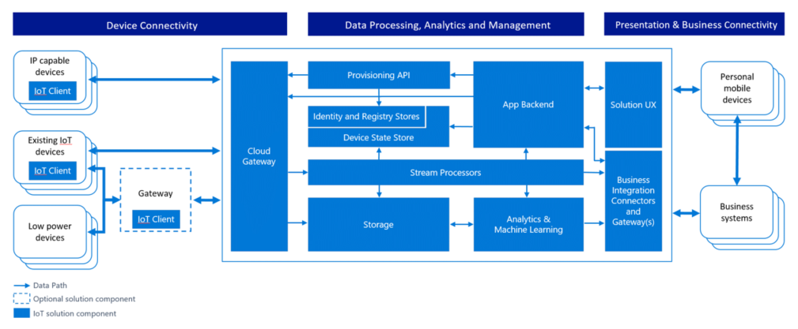

# Internet der Dinge Sicherheitsarchitektur

Beim Entwerfen eines Systems, ist es wichtig zu verstehen die potenziellen Risiken für dieses System, und fügen Sie den entsprechende Schutzmechanismen ein entsprechend, wie das System entwickelt und ausgelegt ist. Es ist besonders wichtig, um das Produkt vom Anfang mit im Hinblick auf Sicherheit zu gestalten, da verstehen, wie ein Angreifer ein System manipulieren können möglicherweise stellen Sie sicher, dass die entsprechenden Problembehebungen hilft werden vom Anfang. 

## Sicherheit beginnt mit einem Bedrohungsmodell
 
Microsoft Bedrohungsmodelle für seine Produkte bereits seit langem eingesetzt und hat des Unternehmens Bedrohungsmodellierungsprozesses öffentlich verfügbar gemacht werden. Mit der Firma veranschaulicht, dass die Modellierung weist unerwartete Vorteile jenseits der direkten welche Risiken, die am häufigsten sind Verständnis betreffend. Beispielsweise wird erstellt auch Möglichkeit geschaffen für eine offene Diskussion mit anderen Personen außerhalb der Entwicklungsteam, was Ideen neue und verbesserte das Produkt führen kann.
  
Ziel des Erstellens von Bedrohungsmodellen ist zu verstehen, wie ein Angreifer möglicherweise ein System und dann sicherzustellen, dass die entsprechende Problembehebungen angeordnet werden können. Bedrohung Modellierung erzwingt das Design der Teamwebsite Problembehebungen berücksichtigen, wie das System ausgelegt ist und nicht nach einem System bereitgestellt wird. Dies ist entscheidend, da unmöglich ist, also Sicherheitsmaßnahmen für eine Vielzahl von Geräten in das Feld wird fehleranfällig und Kunden Risiko hinterlässt.

Führen Sie viele Entwicklungsteams hervorragende Arbeit funktionsübergreifendes Anforderungen für das System, die Kunden profitieren erfassen. Identifizieren nicht offensichtlich Möglichkeiten, dass jemand das System Missbrauch möglicherweise ist jedoch schwieriger. Bedrohungsmodelle Entwicklungsteams vertraut, ein Angreifer möglicherweise helfen kann und warum. Erstellen von Bedrohungsmodellen ist ein strukturierter Prozess, der erstellt eine Diskussion über die Sicherheit Entscheidungen Entwurf im System sowie Änderungen des Entwurfs, die dabei die Sicherheit Einfluss vorgenommen werden. Während ein Bedrohungsmodell einfach ein Dokument ist, stellt dieser Dokumentation auch eine ideale Möglichkeit, um sicherzustellen, dass kontinuierlichen Knowledge, Aufbewahrung Lektionen gelernt und Hilfe neue Teamwebsite integrierte schnell an. Schließlich ist ein Ergebnis der Bedrohungsanalyse zu ermöglichen es Ihnen, erwägen Sie andere Aspekte der Sicherheit, z. B. welche Sicherheit Zusagen, die Sie an Ihre Kunden bereitstellen möchten. Diese Zusagen in Verbindung mit Bedrohungsmodellen werden informieren und Testen Ihrer Lösung Internet der Dinge (IoT) versorgen.
 

### Wann Verfahren zum Erstellen von Modell

[Threat modeling](http://www.microsoft.com/security/sdl/adopt/threatmodeling.aspx) bietet den größten Wert, wenn sie in der Entwurfsphase eingebunden werden. Wenn Sie entwerfen, müssen Sie die größte Flexibilität Risiken vermeiden bearbeiten möchten. Beseitigen von Risiken durch Entwurf wird das gewünschte Ergebnis. Es ist viel einfacher Problembehebungen hinzufügen, sie testen und diese bleiben aktuelle und darüber hinaus solche Beseitigung ist nicht immer möglich sicherzustellen. Es wird immer schwieriger zu Risiken wie ein Produkt mehr Reifen wird und wiederum schließlich benötigt mehr Arbeit und viel schwieriger Kompromisse als Bedrohungsmodelle frühzeitig bei der Entwicklung zu unterdrücken.

### Welche Verfahren zum Erstellen von Modell

Thread-Modell die Lösung als Ganzes, und auch den Fokus erhält in den folgenden Bereichen:

- Die Features für Sicherheit und Datenschutz
- Die Features, deren Fehlern Sicherheit relevant sind
- Die Funktionen, die eine Begrenzungslinie Trust berühren 

### Die Verfahren zum Erstellen von Datenmodellen

Erstellen von Bedrohungsmodellen umfasst wie jedes andere.  Es ist eine gute Idee, behandelt das Modell Bedrohungsdokument wie alle anderen Bestandteil der Lösung, und überprüfen ihn. Führen Sie viele Entwicklungsteams hervorragende Arbeit funktionsübergreifendes Anforderungen für das System, die Kunden profitieren erfassen. Identifizieren nicht offensichtlich Möglichkeiten, dass jemand das System Missbrauch möglicherweise ist jedoch schwieriger. Bedrohungsmodelle Entwicklungsteams vertraut, ein Angreifer möglicherweise helfen kann und warum.

### So Verfahren zum Erstellen von Modell

Erstellen von Bedrohungsmodellen besteht aus vier Schritten; die Schritte sind:

- Modellieren der Anwendungs
- Auflisten von Risiken
- Minimieren Sie Risiken
- Überprüfen Sie die Problembehebungen

#### Prozessschritte

Drei Regeln gilt beim Erstellen eines Bedrohungsmodells bedenken:

1. Erstellen eines Diagramms aus den Bezug Architektur an. 
2. Starten Sie zuerst der Breite ein. Eine Übersicht und das System als Ganzes vor dem tief Einstieg verstanden.  Dadurch wird sichergestellt, Sie tief greifende an den richtigen stellen.
3. Den Prozess Laufwerk, nicht zulassen, dass des Prozess Sie versorgen. Wenn Sie ein Problem in der Phase Modellierung suchen und sie auswerten möchten, beginnen Sie damit!  Nicht fällt Servicekraft diese Schritte ausgeführt werden müssen.  

#### Risiken

Die vier zentralen Elemente von einem Bedrohungsmodell sind:

- Prozesse (Webdienste, Win32-Dienste * nix-Daemons usw.. Beachten Sie, dass einige komplexen Einheiten (z. B. Feld Gateways und Sensoren) abstrahiert werden können, wie ein Vorgang, wenn eine technische Drilldown in diese Bereiche nicht möglich ist.
- Daten speichert (überall, die Daten, wie etwa einer Konfigurationsdatei oder Datenbank gespeichert werden)
- Datenfluss (wobei Daten zwischen andere Elemente in der Anwendung ausgeführt werden)
- Externen Einheiten (alle Elemente, die mit dem System interagiert aber nicht unter der Kontrolle über die Anwendung, Beispielen gehören Benutzer und Satelliten-Feeds)

Alle Elemente im Diagramm Architektur werden verschiedene Risiken; Wir verwenden das mnemonische Schrittweite. [Threat Modeling erneut Schritt](https://blogs.msdn.microsoft.com/larryosterman/2007/09/04/threat-modeling-again-stride/) Weitere Informationen zu den Elementen Schrittweite lesen.

Verschiedene Elemente des Anwendungsdiagramms unterliegen bestimmte Risiken Schrittweite aus:

- Prozesse unterliegen Schrittweite
- Daten Zahlungen unterliegen TID
- Datenspeicher unterliegen TID und manchmal R ein, wenn die Datenspeicher Protokolldateien sind.
- Externe Elemente werden SRD

## Sicherheit in IoT

Verbundenen spezielle Geräte haben eine signifikante Anzahl von möglichen Interaktion einbinden Bereiche und Interaktion Mustern, die einen Rahmen zum Sichern des digitalen Zugriff auf diese Geräte bieten berücksichtigt werden müssen. Der Begriff "digital Access" wird hier verwendet durch jeden Vorgang unterscheiden, die durch direkte Gerät Interaktion ausgeführt werden, in denen Zugriffsschutz durch physischen Zugriff Steuerelement angegeben. Beispielsweise Inbetriebnahme das Gerät einen Raum mit einer Sperre klicken Sie auf die Türen. Während der physischen Zugriff verweigert werden kann, verwenden Software- und können Maßnahmen zu führenden System störempfindlichen physischen Zugriff verhindern. 

Erfahren Sie die Interaktion Muster, sehen wir sich "Gerät Control" und "Gerätedaten" mit der gleichen Ebene der Aufmerksamkeit. "Device Control" kann als alle Informationen klassifiziert werden, die ein Gerät von jegliche mit dem Ziel ändern oder dessen Verhalten in Richtung Zustand oder den Zustand seiner Umgebung beeinflussen bereitgestellt wird. "Gerätedaten" können als alle Informationen klassifiziert werden, die ein Gerät an eine andere Partei zu Zustand und seiner Umgebung der beobachteten Zustand gibt aus.
   
Bewährte Methoden für Sicherheit optimieren möchten, empfiehlt es sich, dass eine typische IoT Architektur als Teil der ein Bedrohungsmodell in mehreren Komponente/Zonen unterteilt werden. Diese Zonen vollständig in diesem Abschnitt beschrieben sind und umfassen:

-   Gerät
-   Feld-Gateway
-   Cloud-Gateways, und
-   Dienste.

Zonen sind allgemeinen Weise zu segmentieren eine Lösung. Jede Zone verfügt häufig eine eigene Daten und Authentifizierung und Autorisierung Anforderungen an. Zonen können auch verwendet werden, um Isolation Schaden und den Einfluss der niedriger Vertrauenswürdigkeit Zonen auf höhere vertrauenswürdige Zonen einschränken.

Jede Zone wird durch eine Begrenzungslinie vertrauen getrennt, die als die gepunktete rote Linie im nachstehenden Diagramm gekennzeichnet ist. Ihn darstellt ein Übergangs von Data-Informationen aus einer Quelle zu einem anderen. Während dieses Übergangs könnte die Data-Informationen Spoofing, Tampering, Ablehnung, Offenlegung von Informationen, Dienstausfall und Erhöhung der Berechtigung (Schritt).

 

Die Komponenten innerhalb jeder Begrenzungslinie dargestellt werden auch in einer Schrittweite, aktivieren eine vollständige 360 Bedrohungsanalyse Ansicht der Lösung. In den folgenden Abschnitten weiter auszuführen auf jeder der Komponenten und bestimmte Sicherheitsgründen und Lösungen, die in dem Ort gespeichert werden soll.

Die Abschnitte, die folgt besprechen standard Komponenten, die in der Regel in diesen Zonen gefunden.

### Die Zone Gerät

Die Umgebung Gerät wird die sofortige Platzbedarf, um das Gerät aus, wobei physische Access und/oder "Lokales Netzwerk" digitale Peer-to-Peer-Zugriff auf das Gerät soweit möglich ist. Ein "Lokales Netzwerk" wird davon ausgegangen, dass in einem Netzwerk sein, der distinct und isoliert aus – aber potenziell an – das öffentliche Internet bridged, und alle eine drahtlose Optionsfeld-Technologie, über die Peer-to-Peer-Kommunikation Geräte. Es werden ** keine Netzwerk-Virtualisierung-Technologie erstellen den Eindruck eines lokalen Netzwerks einschließen und Operator öffentliche Netzwerke, die alle zwei Geräten für die Kommunikation über öffentliche Netzwerk Leerzeichen, wären sie geben Sie eine Beziehung Peer-to-Peer-Kommunikation erfordern wird auch nicht berücksichtigt.

### Das Feld Gateway Zone

Feld-Gateway ist ein Gerät/Einheit oder einiger allgemeiner Server Computersoftware, die als Unterstützung der Kommunikation und potenziell, als Gerät Steuerelement System und Gerät Datenverarbeitung Hub dient. Die Feld Gateway Zone enthält das Feld Gateway selbst und alle Geräte, die sie zugeordnet sind. Wie der Name sagt, Feld Gateways externe dedizierten Datenverarbeitung Fertigungsanlagen fungieren, normalerweise Speicherort gebunden sind, werden potenziell physische Intrusion, und werden eingeschränkten redundante Betriebssicherheit Schutz. Alle, um besagen, dass ein Feld Gateway häufig mit einem Gegenstand ist kann eine berühren und andere Daten verwendet, wissen, was deren Funktion ist. 

Ein Gateway Feld unterscheidet sich von einem reinen Datenverkehr darin, dass es wurde keine aktive Rolle in Verwalten des Zugriffs und Informationsfluss, d. h., es ist, dass eine Anwendung Entität und Netzwerk Verbindung oder terminal Sitzung adressiert. Ein NAT-Gerät oder die Firewall, dagegen berechtigen nicht als Feld Gateways, da sie nicht explizite Verbindung oder Sitzung umsteigebahnhöfe, aber lieber eine Verbindungen Routing (oder des Blocks) sind oder Sitzungen in ihnen vorgenommen. Das Feld Gateway weist zwei unterschiedliche einbinden Bereichen. Eine zeigen Sie die Geräte, die an die er angefügt werden muss innerhalb der Zone darstellt und die anderen Flächen alle externe Teilnehmern am Rand der Zone ist.   

### Die Cloud Gateway zone

Cloud-Gateway ist ein System, das DFÜ-Vorgänge aus und Geräten oder Feld Gateways aus mehreren unterschiedlichen Standorten über öffentliche Netzwerk Leerzeichen, in der Regel in Richtung eines cloudbasierten Steuerelement und Analyse Datensystem, eine Föderation dieser Systeme ermöglicht. In einigen Fällen möglicherweise ein Gateway Cloud sofort Zugriff auf spezielle Geräte aus umsteigebahnhöfe wie Tablets oder Telefone erleichtern. In dem Kontext hier beschriebenen "Cloud" soll eine dedizierte Datenverarbeitungssystem verweisen, die nicht am selben Standort wie die angeschlossenen Geräten oder Feld Gateways gebunden ist. Auch in einer Zone Cloud Betriebskennzahlen zielgerichteten physischen Zugriff verhindern, und für eine "Öffentliche Cloud" Infrastruktur nicht unbedingt sichtbar.  

Ein Gateway Cloud kann potenziell in einem Netzwerk Virtualisierung Überlagerung in der Cloud Gateway und alle zugehörigen angeschlossenen Geräten oder Feld Gateways aus einem beliebigen anderen Netzwerkverkehr isolieren zugeordnet werden. Das Cloud-Gateway selbst ist weder ein Gerät Steuerelement System noch eine Verarbeitung oder Terminologiespeicher für Gerätedaten; Diese Fertigungsanlagen-Oberfläche mit dem Gateway Cloud. Die Cloud Gateway Zone umfasst das Cloud Gateway selbst zusammen mit allen Feld Gateways und Geräten, die direkt oder indirekt angefügt. Am Rand der Zone ist eine distinct Oberfläche, in dem alle externe Parteien über kommunizieren.

### Die Zone services

Für diesen Kontext als beliebige Software-Komponente und das Modul, das mit Geräte über ein Feld – oder Cloud Gateway für Datensammlung und Analyse und Befehl und Steuerelement prüfen verbunden ist, wird eine "Service" definiert.  Services sind Vermittler. Sie unter seine Identität in Richtung Gateways und anderen Teilsystemen fungieren, speichern und Analysieren von Daten, unabhängig Befehle zu Geräte basierend auf datenerkenntnissen oder Zeitpläne und Informationen verfügbar machen und Funktionen für autorisierte Endbenutzer steuern.

### Informationen-Geräten im Vergleich zum spezielle Geräte

PCs, Mobiltelefonen und Tablets sind hauptsächlich interaktive Informationen Geräte. Mobiltelefone und Tablets sind explizit um maximieren Batterielebensdauer optimiert. Diese deaktivieren vorzugsweise teilweise, wenn nicht sofort interagieren mit einer Person oder nicht-Dienste wie Wiedergeben von Musik oder er begleitet deren Besitzer an einem bestimmten Speicherort bereit. Im Hinblick auf Systeme fungieren diese Informationen Technologie Geräte hauptsächlich als Proxys in Richtung Personen. Sie sind "Personen Aktuatoren" vorschlagen von Aktionen und "Personen Sensoren" Eingabesprache sammeln. 

Spezielle Geräte, unterscheiden sich von einfachen Temperatursensoren für komplexe Factory Herstellung Zeilen Tausende von Komponenten in diese. Diese Geräte sind viel mehr in Zweck ausgelegte und auch, wenn sie einige Benutzeroberfläche bereitzustellen, sie werden auf eine Schnittstelle mit weitgehend ausgelegte oder in Anlagen in der physischen Welt integriert werden. Diese messen und melden Umgebung Umständen, ventilkonstruktionen aktivieren, Servos steuern, Klingeltöne Alarme, Leuchten wechseln und viele weitere Aufgaben. Sie verhelfen arbeiten, führen Sie für die ein Gerät Informationen entweder zu Allgemein, auch teure, zu groß oder zu spröder ist. Beton Zweck schreibt sofort ihren technischen Entwurf als auch das verfügbare Budget für ihre Herstellung und geplanten Lebensdauer Vorgang vor. Die Kombination der folgenden zwei wichtigen Faktoren schränkt die verfügbaren Betrieb Aufwand Budget, physische Platzbedarf und somit verfügbaren Speicherplatz berechnen und Sicherheitsfunktionen.  

Wenn etwas "wechselt falsche" mit automatisierte und remote gesteuert Geräte, Fehlern beispielsweise physische Grafikhardware oder Steuerelementlogik Einhaltung Anmeldekennwort und Bearbeitung. Der Herstellung viele gelöscht werden können, Gebäude möglicherweise looted oder brennen nach unten, und Personen möglicherweise verletzt oder sogar Die. Dies ist natürlich eine gesamte andere Klasse von Schäden als eine Person, eine gestohlen Kreditkarte Grenzwert maximal ausnutzen. Die Sicherheit Leiste Geräten, die Dinge zu verschieben, und auch für Sensordaten, die später Befehle, die Punkte ergibt, die Sie verschieben möchten, führen muss größer als in einem beliebigen e-Commerce oder Bank Szenario sein. 

### Steuerelement für Geräte und Gerät Dateninteraktionen

Verbundenen spezielle Geräte haben eine signifikante Anzahl von möglichen Interaktion einbinden Bereiche und Interaktion Mustern, die einen Rahmen zum Sichern des digitalen Zugriff auf diese Geräte bieten berücksichtigt werden müssen. Der Begriff "digital Access" wird hier verwendet durch jeden Vorgang unterscheiden, die durch direkte Gerät Interaktion ausgeführt werden, in denen Zugriffsschutz durch physischen Zugriff Steuerelement angegeben. Beispielsweise Inbetriebnahme das Gerät einen Raum mit einer Sperre klicken Sie auf die Türen. Während der physischen Zugriff verweigert werden kann, verwenden Software- und können Maßnahmen zu führenden System störempfindlichen physischen Zugriff verhindern. 
 
Erfahren Sie die Interaktion Muster, sehen wir sich "Gerät Control" und "Gerätedaten" mit der gleichen Ebene der Aufmerksamkeit beim Erstellen von Bedrohungsmodellen. "Device Control" kann als alle Informationen klassifiziert werden, die ein Gerät von jegliche mit dem Ziel ändern oder dessen Verhalten in Richtung Zustand oder den Zustand seiner Umgebung beeinflussen bereitgestellt wird. "Gerätedaten" können als alle Informationen klassifiziert werden, die ein Gerät an eine andere Partei zu Zustand und seiner Umgebung der beobachteten Zustand gibt aus. 

## Erstellen von Gefahrenmodellen die Azure IoT Bezug Architektur

Microsoft verwendet, um Verfahren zum Erstellen von für Azure IoT Modellierung oben beschriebenen Rahmen. Im Abschnitt unten verwenden wir daher das Beispiel Beton Azure IoT Bezug Architektur um zu veranschaulichen, wie Bedrohung für IoT Modellierung anzustellen und wie Sie die Adresse, der Risiken identifiziert. In diesem Fall identifiziert wir vier Hauptbereichen des Fokus aus:

-   Geräte und Datenquellen
-   Datenübertragung,
-   Gerät und Ereignisse zu verarbeiten, und
-   Präsentation

 

Im nachstehenden Diagramm bietet eine vereinfachte Ansicht des Microsoft IoT Architektur mit einem Datenflussdiagramm-Modell, das durch die Microsoft Threat Modeling Tool verwendet wird:

Es ist wichtig, beachten Sie, dass die Architektur-Funktionen, die das Gerät und dem Gateway geteilt werden. Dies ermöglicht dem Benutzer, Gateway-Geräte zu nutzen, die sicherer sind: sie sind mit der Cloud-Gateway mit sicherer Protokolle, die in der Regel erfordert größer Verarbeitung Aufwand einer systemeigenen Gerät – beispielsweise ein Thermostat - eigenständig bereitstellen konnte kommunizieren kann. In der Zone Azure Services wird davon ausgegangen, dass das Gateway Cloud vom Dienst Azure IoT Hub dargestellt wird.

### Geräte- und Quellen/Datenübertragung

In diesem Abschnitt untersucht die oben beschriebene, bis die Lens der Bedrohungsanalyse Architektur und bietet einen Überblick darüber, wie wir einige der gehörende Bedenken adressieren sind. Wir werden auf die wichtigsten Elemente von einem Bedrohungsmodell konzentrieren:

- Prozesse (die unter unseren Kontrolle und externe Elemente)
- Kommunikation (auch Daten Zahlungen genannt)
- Speicher (auch als Datenspeicher bezeichnet)

#### Prozesse

In jedem der in der Architektur Azure IoT gegliederter Kategorien können wir versuchen Sie, eine Reihe von anderen Risiken in den verschiedenen Stufen zu verringern Data-Informationen jeglichen: Prozess, Kommunikation und Speicher. Im folgenden geben wir einen Überblick über die am häufigsten verwendeten Methoden für die Prozesskategorie "", gefolgt von einen Überblick darüber, wie diese am besten verringert werden konnte: 

**Spoofing (S)**: ein Angreifer möglicherweise cryptographic Key Material aus einem Gerät Ebene der Software oder Hardware extrahieren und anschließend wurde Access das System mit einem anderen physischen oder virtuellen Gerät unter der Identität des Geräts Schlüssel aus übernommen. Eine gute Abbildung ist Remote-Steuerelemente können, die jeden beliebigen Bildschirm zu aktivieren und beliebte pubertären Tools sind.

**DOS-of Service (D)**: ein Gerät nicht in der Lage funktionsfähiges oder die Kommunikation per stören Optionsfeld Häufigkeiten oder Ausschneiden Kabel gerendert werden kann. Beispielsweise wird Überwachung Kamera, die zugehörigen Power oder Netzwerk-Verbindung absichtlich Ausgesparte hatten keine Daten überhaupt angezeigt werden.

**Manipuliert werden (T)**: ein Angreifer möglicherweise ganz oder teilweise ersetzen die Software auf dem Gerät ausführen potenziell gleicht ersetzte Software für der Echtheit des Geräts nutzen wäre Schlüssel oder die Funktionen für die cryptographic Key Material gedrückt unerlaubten Programms zur Verfügung. Beispielsweise kann ein Angreifer extrahierten Key Material um Achsenabschnitt unterdrücken Daten vom Gerät auf den Kommunikationspfad und Ersetzen Sie ihn durch falsch Daten, die mit dem gestohlen Key Material authentifiziert wird nutzen.

**Informationsfreigabe (I)**: Wenn Sie das Gerät manipulierten Software ausgeführt wird, konnte solche manipulierten Software potenziell unbefugten Daten verlieren. Beispielsweise kann ein Angreifer extrahierten Key Material um selbst in den Kommunikationspfad zwischen dem Gerät und eine Controller oder ein Feld Gateway oder Cloud-Gateway zu deaktivieren Informationen einbeziehen einfügen nutzen.

**Erhöhung der Berechtigung (E)**: ein Gerät, das bestimmte Funktion erledigt kann etwas anderes tun wird. Beispielsweise kann eine hydrogeräten, die so programmiert ist, öffnen Sie halb dazu veranlasst werden, um ganz zu öffnen.

| **Komponente** | **Bedrohung** | **Reduzierung**                                                                                                                                                | **Risiken**                                                                                                                                                                                                    | **Implementierung**                                                                                                                                                                                                                                                                                                                                     |
|---------------|------------|---------------------------------------------------------------------------------------------------------------------------------------------------------------|-------------------------------------------------------------------------------------------------------------------------------------------------------------------------------------------------------------|--------------------------------------------------------------------------------------------------------------------------------------------------------------------------------------------------------------------------------------------------------------------------------------------------------------------------------------------------------|
| Gerät        | S          | Das Gerät Identität zuweisen und die Authentifizieren des Geräts                                                                                                | Ersetzen Gerät oder einen Teil des Geräts mit einem anderen Gerät aus. Woher wissen wir, dass wir ein Gespräch mit dem richtigen Gerät?                                                                                           | Authentifizieren das Gerät, Sicherheit TLS (Transport Layer) oder IPSec verwenden. Infrastruktur sollte unterstützt mit vorinstallierten Schlüssel (PSK) auf diesen Geräten, die vollständige asymmetrische Verschlüsselung verarbeitet werden können. Nutzen Sie Azure AD, [OAuth](http://www.rfc-editor.org/in-notes/internet-drafts/draft-ietf-ace-oauth-authz-01.txt)                             |
|               | TRID       | Übernehmen Sie nicht manipulierbares Verfahren für das Gerät beispielsweise und es schwierig zu unmöglich zum Extrahieren von Tasten und anderen cryptographic Material vom Gerät mit. | Das Risiko ist, wenn jemand das Gerät (physische Interferenzen) Manipulation ist. Wie wir sind sicher, das Gerät nicht manipuliert.                                                                                 | Die effektivste Problembehebung ist eine vertrauenswürdige Plattform Module (TPM)-Funktion, die es das Speichern von Tasten in spezielle Integrierte Schaltkreise, aus denen die Tasten können nicht gelesen werden ermöglicht, aber nur für cryptographic Vorgänge, die die Taste verwenden, aber nie Zwecken die Taste verwendet werden können. Arbeitsspeicher Verschlüsselung des Geräts. Verwalten von Schlüsseln für das Gerät. Signieren des Codes. |
|               | E          | Probleme, Access-Steuerung des Geräts. Autorisierung des Farbschemas.                                                                                                    | Wenn das Gerät für einzelne auszuführenden Aktionen basierend auf Befehle aus einer externen Quelle oder sogar betroffenen Sensoren ermöglicht es, die Angriffen zum Ausführen von Vorgängen ansonsten nicht zugegriffen werden können. | Autorisierung des Farbschemas für das Gerät Probleme                                                                                                                                                                                                                                                                                                             |
| Feld Gateway | S          | Authentifizieren des Gateways Feld mit Cloud Gateway (Zertifikat basiert, PSK, wenn diese darauf basieren,...)                                                                           | Wenn jemand Feld Gateway Spoofing kann, kann es selbst dann als jedem Gerät präsentieren.                                                                                                                               | TLS RSA/PSK, IPSe, [RFC 4279](https://tools.ietf.org/html/rfc4279). Sämtliche Speicher und Befähigungsnachweis Fragen von Geräten im Allgemeinen – bewährte Groß-/Kleinschreibung wird verwenden TPM. 6LowPAN Erweiterung für IPSec zur Unterstützung von Wireless Sensor Netzwerken (WSN).                                                                                                              |
|               | TRID       | Schützen Sie das Feld Gateway gegen Manipulation (TPM?)                                                                                                            | Spoofingangriffe, die an der Cloud-Gateway zu verleiten, die es zum Feld Gateway zu sprechen könnte Informationsfreigabe und Datenmanipulation führen                                                             | Arbeitsspeicher Verschlüsselung, TPM des, Authentifizierung.                                                                                                                                                                                                                                                                                                              |
|               | E          | Zugriffskontrollmechanismus für Gateway-Feld                                                                                                                    |                                                                                                                                                                                                             |                                                                                                                                                                                                                                                                                                                                                        |

Hier sind einige Beispiele für Risiken dieser Kategorie aus:

Spoofing: Ein Angreifer möglicherweise extrahieren cryptographic Key Material auf einem Gerät, entweder auf der Software oder Hardware, und anschließend Access, die das System mit einem anderen physischen oder virtuellen Gerät unter der Identität des Geräts Schlüssel entnommen wurde.

**Dienstausfall**: ein Gerät nicht in der Lage funktionsfähiges oder die Kommunikation per stören Optionsfeld Häufigkeiten oder Ausschneiden Kabel gerendert werden kann. Beispielsweise wird Überwachung Kamera, die zugehörigen Power oder Netzwerk-Verbindung absichtlich Ausgesparte hatten keine Daten überhaupt angezeigt werden.

**Tampering**: Angreifer möglicherweise ganz oder teilweise ersetzen die Software auf dem Gerät ausgeführt und damit ersetzte Software für der Echtheit des Geräts nutzen wäre Schlüssel oder die Funktionen für die cryptographic Key Material gedrückt unerlaubten Programms zur Verfügung.

**Tampering**: Überwachung Kamera, die mit einer sichtbaren Spektrums Bild von einer leeren Gang ist bei eines Fotos von einem solchen Gang gerichtet werden konnte. Ein Sensor Rauch oder Fire konnte eine Person mit einem heller darunter reporting. In beiden Fällen das Gerät möglicherweise technisch in Richtung des Systems vollständig vertrauenswürdig, aber es wird ein Bericht mit manipulierten Informationen.

**Tampering**: ein Angreifer möglicherweise nutzen extrahierten Key Material um Achsenabschnitt unterdrücken Daten vom Gerät auf den Kommunikationspfad und Ersetzen Sie ihn durch falsch Daten, die mit dem gestohlen Key Material authentifiziert wird.

**Tampering**: Angreifer möglicherweise teilweise oder vollständig ersetzen die Software auf dem Gerät, ausgeführt und damit ersetzte Software für der Echtheit des Geräts nutzen wäre Schlüssel oder die Funktionen für die cryptographic Key Material gedrückt unerlaubten Programms zur Verfügung.
   
**Offenlegung von Informationen**: Wenn Sie das Gerät manipulierten Software ausgeführt wird, konnte solche manipulierten Software potenziell unbefugten Daten verlieren.

**Informationsfreigabe**: ein Angreifer möglicherweise nutzen extrahierten Key Material um selbst in den Kommunikationspfad zwischen dem Gerät und einem Controller oder Feld Gateway oder Cloud-Gateway zu deaktivieren Informationen einbeziehen einzufügen.

**Dienstausfall**: das Gerät aktiviert in einem Modus, in dem kein Kommunikation möglich (das ist in vielen industrielle Maschinen beabsichtigt) oder deaktiviert werden kann.

**Tampering**: das Gerät kann neu konfiguriert werden, um Benutzer in einem unbekannten an das Steuerelement System (außerhalb bekannte Kalibrierungsparameter) Zustand und somit bereitzustellen Daten, die möglicherweise falsch interpretiert werden können

**Erhöhung von Berechtigungen**: ein Gerät, das bestimmte Funktion erledigt kann etwas anderes tun wird. Beispielsweise kann eine hydrogeräten, die so programmiert ist, öffnen Sie halb dazu veranlasst werden, um ganz zu öffnen.

**Dienstausfall**: das Gerät aktiviert werden kann, in einem Zustand Kommunikation nicht möglich ist.

**Tampering**: das Gerät kann neu konfiguriert werden, um Benutzer in einem unbekannten an das Steuerelement System (außerhalb bekannte Kalibrierungsparameter) Zustand und somit bereitzustellen Daten, die möglicherweise falsch interpretiert werden können.
 
**Spoofing/Tampering/Ablehnung**: Wenn nicht gesichert (Dies ist selten der Fall mit Consumer Remote-Steuerelemente) ein Angreifer kann den Status eines Geräts anonym bearbeiten. Eine gute Abbildung ist Remote-Steuerelemente können, die jeden beliebigen Bildschirm zu aktivieren und beliebte pubertären Tools sind.

#### Kommunikation

Risiken, um den Kommunikationspfad zwischen Geräten, Geräte und Feld Gateways und Gerät und Cloud Gateway. In der nachfolgenden Tabelle weist einige Richtlinien, um offene Sockets auf dem Gerät/VPN:

| **Komponente**               | **Bedrohung** | **Reduzierung**                                      | **Risiken**                                                                                                      | **Implementierung**                                                                                                                                                                                                                                                                                                                                                               |
|-----------------------------|------------|-----------------------------------------------------|---------------------------------------------------------------------------------------------------------------|----------------------------------------------------------------------------------------------------------------------------------------------------------------------------------------------------------------------------------------------------------------------------------------------------------------------------------------------------------------------------------|
| Gerät IoT Hub              | TID        | (D) TLS (PSK/RSA), um den Datenverkehr zu verschlüsseln             | Abhören des oder die Kommunikation zwischen dem Gerät und dem Gateway stören                             | Sicherheit auf der Protokollebene. Mit benutzerdefinierten Protokolle müssen wir herausfinden, wie, um diese zu schützen. In den meisten Fällen erfolgt die Kommunikation vom Gerät an den IoT Hub (Gerät initiiert die Verbindung).                                                                                                                                                                 |
| Gerät Gerät               | TID        | (D) TLS (PSK/RSA), um den Datenverkehr zu verschlüsseln.            | Lesen von Daten zwischen Geräten übertragen. Manipulation der Daten. Das Gerät mit neuen Verbindungen überladen | Sicherheit auf der Ebene Protocol (MQTT/AMQP/HTTP/CoAP. Mit benutzerdefinierten Protokolle müssen wir herausfinden, wie, um diese zu schützen. Die Problembehebung für das Risiko DoS ist peer Geräte über ein Gateway Cloud oder eines Felds und können nur Act als Clients rechts im Netzwerk haben. Die peering kann eine direkte Verbindung zwischen der Kollegen nach Probleme vermittelte wurde, indem Sie das Gateway zu führen |
| Externe Entität Gerät      | TID        | Signifikante Bündeln von der externen Entität am Gerät | Abhören der Verbindungs mit dem Gerät an. Beeinflussen der Kommunikation mit dem Gerät                     | Sichere Verbindung die externe Entität am Gerät NFK/Bluetooth LE. Steuern der Bedienfeld des Geräts (physisch)                                                                                                                                                                                                                                                  |
| Feld Gateway Cloud Gateway | TID        | TLS (PSK/RSA), um den Datenverkehr zu verschlüsseln.               | Abhören des oder die Kommunikation zwischen dem Gerät und dem Gateway stören                             | Sicherheit auf der Ebene Protocol (MQTT/AMQP/HTTP/CoAP). Mit benutzerdefinierten Protokolle müssen wir herausfinden, wie, um diese zu schützen.                                                                                                                                                                                                                                                       |
| Gerät Cloud Gateway        | TID        | TLS (PSK/RSA), um den Datenverkehr zu verschlüsseln.               | Abhören des oder die Kommunikation zwischen dem Gerät und dem Gateway stören                             | Sicherheit auf der Ebene Protocol (MQTT/AMQP/HTTP/CoAP). Mit benutzerdefinierten Protokolle müssen wir herausfinden, wie, um diese zu schützen.                                                                                                                                                                                                                                                       |

Hier sind einige Beispiele für Risiken dieser Kategorie aus:

**Dienstausfall**: eingeschränkten Geräte sind im Allgemeinen DoS Risiko ausgesetzt, wenn diese aktiv eingehenden Verbindungen oder unerwünschte Datagramme in einem Netzwerk, überwachen, da ein Angreifer öffnen kann viele Verbindungen parallel und nicht Dienstleistungen bereit oder sehr langsam Dienstleistungen bereit, oder das Gerät kann mit unerwünschten Datenverkehr übertragen werden. In beiden Fällen kann das Gerät effektiv möglicherweise nicht mehr im Netzwerk gerendert werden.

**Spoofing, Informationsfreigabe**: eingeschränkte Geräte und spezielle Geräte haben oft eine für alle Sicherheit Fertigungsanlagen wie Kennwort oder die PIN Schutz oder diese übereinstimmenden basieren auf vertrauen im Netzwerk, d. h., sie werden Zugriff auf Informationen erteilen, wenn ein Gerät befindet sich in demselben Netzwerk und in diesem Netzwerk häufig nur von einem freigegebenen Schlüssel geschützt ist. Das heißt, wenn das freigegebene Geheimnis Gerät oder Netzwerk offen gelegt werden, es möglich ist, das Gerät steuern oder beobachten Daten aus dem Gerät ausgegeben.  

**Spoofing**: ein Angreifer Achsenabschnitt oder teilweise außer Kraft setzen übertragen und den Ersteller (Mann in der Mitte) Spoofing möglicherweise

**Tampering**: ein Angreifer Achsenabschnitt oder teilweise außer Kraft setzen übertragen und falsche Informationen senden kann 

**Informationsfreigabe:** Angreifer möglicherweise eine übertragen abzuhören und Sie erhalten Informationen ohne Autorisierung **Dienstausfall:** ein Angreifer möglicherweise das übertragenen Signal jam und verweigern Informationen Verteilung

#### Speicher

Jeder Gerät und das Feld Gateway enthält einige Formular Speicher (temporär für die Daten, os Bild Speicher queuing).

| **Komponente**                            | **Bedrohung** | **Reduzierung**                       | **Risiken**                                                                                                                                                                                                                                                                                                                | **Implementierung**                                                                                                                                                     |
|------------------------------------------|------------|--------------------------------------|-------------------------------------------------------------------------------------------------------------------------------------------------------------------------------------------------------------------------------------------------------------------------------------------------------------------------|------------------------------------------------------------------------------------------------------------------------------------------------------------------------|
| Speicher des Geräts                           | TRID       | Speicher Verschlüsselung, bei der Anmeldung die Protokolle | Lesen von Daten aus dem Speicher (PII-Daten), werden Daten manipulieren. Mit manipuliert werden in der Warteschlange oder Cache Befehl Steuerelementdaten. Konfiguration oder Firmware-Paketen manipulieren kann während der Cache oder lokal in der Warteschlange zu OS und/oder System Komponenten gefährdet wird führen                                         | Verschlüsselung, Meldungsauthentifizierungscode (MAC) oder die digitale Signatur. Wo möglich, sicherer Zugriffskontrolle über Access Ressource Zugriffssteuerungslisten oder Berechtigungen steuern. |
| Bildtyp OS                          | TRID       |                                      | OS manipulieren / ersetzen die OS-Komponenten                                                                                                                                                                                                                                                                         | Schreibgeschützte Betriebssystempartition angemeldet OS Bild-, Verschlüsselung                                                                                                                    |
| Feld Gateway-Speicher (queuing Daten) | TRID       | Speicher Verschlüsselung, bei der Anmeldung die Protokolle | Lesen von Daten aus dem Speicher (PII-Daten), werden Daten manipulieren manipulieren in der Warteschlange oder Cache Befehl Steuerelementdaten. Manipulieren der Konfiguration oder Firmware Update-Paketen (für Geräte oder Feld Gateway bestimmt) kann während der Cache oder lokal in der Warteschlange zu OS und/oder System Komponenten gefährdet wird führen | BitLocker                                                                                                                                                              |
| Feld Gateway OS Bild                   | TRID       |                                      | OS manipulieren / ersetzen die OS-Komponenten                                                                                                                                                                                                                                                                          | Schreibgeschützte Betriebssystempartition angemeldet OS Bild-, Verschlüsselung                                                                                                                    |

### Gerät und Ereignis Verarbeitung/Cloud Gateway zone

Ein Gateway Cloud ist System, können remote-Kommunikation von und bis Geräten oder Feld Gateways aus mehreren unterschiedlichen Standorten über öffentliche Netzwerk Leerzeichen, in der Regel in Richtung eines cloudbasierten Steuerelement und Analyse Datensystem, eine Föderation dieser Systeme. In einigen Fällen möglicherweise ein Gateway Cloud sofort Zugriff auf spezielle Geräte aus umsteigebahnhöfe wie Tablets oder Telefone erleichtern. In dem Kontext hier beschriebenen "Cloud", die nicht am selben Standort wie die angeschlossenen Geräten oder Feld Gateways gebunden ist eine dedizierte Datenverarbeitungssystem verweisen soll, und Betrieb Measures, verhindern, dass physischen Zugriff vorgesehen, aber nicht zu einer Infrastruktur "Öffentliche Cloud".  Ein Gateway Cloud kann potenziell in einem Netzwerk Virtualisierung Überlagerung in der Cloud Gateway und alle zugehörigen angeschlossenen Geräten oder Feld Gateways aus einem beliebigen anderen Netzwerkverkehr isolieren zugeordnet werden. Das Cloud-Gateway selbst ist weder ein Gerät Steuerelement System noch eine Verarbeitung oder Terminologiespeicher für Gerätedaten; Diese Fertigungsanlagen-Oberfläche mit dem Gateway Cloud. Die Cloud Gateway Zone umfasst das Cloud Gateway selbst zusammen mit allen Feld Gateways und Geräten, die direkt oder indirekt angefügt.

Cloud-Gateway ist hauptsächlich benutzerdefinierten erstellte Software als Dienst mit verfügbar gemachten Endpunkte mit denen Feld Gateway und Geräte verbinden ausführen. Sie müssen als solche mit im Hinblick auf Sicherheit entworfen werden. Folgen Sie [SDL](http://www.microsoft.com/sdl) -Prozess zum Entwerfen und erstellen diesen Dienst. 

#### Services zone

Ein Steuerelement-System (oder Controller) ist eine Software-Lösung, die eine mit einem Gerät oder einer Feld Gateway oder Cloud Gateway zum Zweck einer oder mehrerer Geräte steuern Schnittstelle und/oder zu sammeln und/oder speichern und/oder Gerätedaten für Präsentation oder nachfolgende Kontrollzwecke analysieren. Steuerungssysteme sind, die nur Elemente in den Bereich dieser Diskussion, die sofort Interaktion mit Personen erleichtern kann. Die Ausnahme sind für physische Steuerelement Flächen auf Geräten, wie ein Schalter, der eine Person, deaktivieren das Gerät, oder ändern die anderen Eigenschaften, und für die es gibt keine funktionsfähige Entsprechung, die Digital zugegriffen werden kann. 

Zwischen-XT für physische Steuerelement Flächen sind die Stelle, an der jeglicher steuern Logik schränkt die Funktion die physische Oberfläche des Steuerelements so, dass eine entsprechende Funktion per Remotezugriff initiiert werden kann oder Eingabewerte Konflikte mit entfernten Eingaben vermieden werden können – solche intermediated Steuerelement Flächen sind im Prinzip angefügter einer Steuerungssysteme, die die gleiche zugrunde liegenden Funktionen wie jedes andere Fernbedienung System nutzt die parallel das Gerät zugeordnet werden kann. Risiken im in der Cloud computing zur Seite [Cloud Security Alliance (CSA)](https://cloudsecurityalliance.org/research/top-threats/) gelesen werden kann.

## Zusätzliche Ressourcen

Finden Sie in den folgenden Artikeln für Weitere Informationen:

- [SDL Threat Modeling Tool](https://www.microsoft.com/sdl/adopt/threatmodeling.aspx)
- [Microsoft Azure IoT Bezug Architektur](https://azure.microsoft.com/updates/microsoft-azure-iot-reference-architecture-available/)
 
